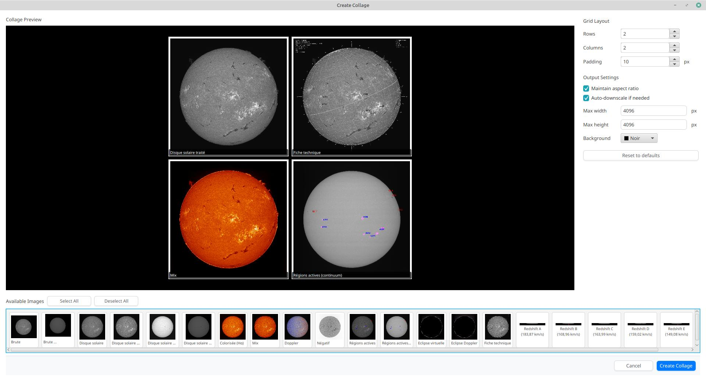

= JSol'Ex
Cédric Champeau
:icons: font
:docinfo: shared

JSol'Ex is a solar images processing software for http://www.astrosurf.com/solex/sol-ex-presentation-en.html[Christian Buil's Sol'Ex].
It is capable of processing SER files captured with this instrument in order to produce images of the solar disk, in a similar way to what http://valerie.desnoux.free.fr/inti/[INTI from Valérie Desnoux] is doing.
It is primarily designed to process images for Sol'Ex, but it will work properly for other kinds of spectroheliographs.

JSol'Ex is free software published under the Apache 2 software license.
It is written in en Java and provided for free without any warranty.

.Note to US citizen and far right supporters
[IMPORTANT]
====
**If you support Trump or any other party close to the far right, I ask you not to use this software.**

My values are fundamentally opposed to those of these parties, and I do not wish for my work, which I have developed during evenings and weekends, and despite it being open source, to be used by people who support these nauseating ideas.

Solidarity, openness to others, ecology, fight against discrimination and inequality, respect for all religions, genders, and sexual orientations are the values that drive me.
I do not accept that my work be used by people who are responsible for suffering and exclusion.
If you do, I kindly ask you to review your choices and turn to more positive values, where your well-being does not come from the rejection of others.
====

== Downloads

Click on the button corresponding to your OS below to download the JSol'Ex installer:

link:https://jsolex.s3.eu-west-3.amazonaws.com/jsolex-windows-latest/{prefixName}-{version}.msi[icon:windows[] JSol'Ex (Windows), role="badge"]
link:https://jsolex.s3.eu-west-3.amazonaws.com/jsolex-ubuntu-latest/{prefixName}_{version}_amd64.deb[icon:linux[] JSol'Ex (Linux), role="badge"]
link:https://jsolex.s3.eu-west-3.amazonaws.com/jsolex-macos-latest/{prefixName}-{version}.pkg[icon:apple[] JSol'Ex (Mac ARM64), role="badge"]
link:https://jsolex.s3.eu-west-3.amazonaws.com/jsolex-macos-15-intel/{prefixName}-{version}.pkg[icon:apple[] JSol'Ex (Mac Intel), role="badge"]

=== Zip files

Some users prefer to download a zip file containing the binaries: without installer, simply unzip the file in a directory of your choice and launch the application (in the `bin` folder, `jsolex.bat` on Windows, `jsolex` on Linux and MacOS).

- link:https://jsolex.s3.eu-west-3.amazonaws.com/jsolex-windows-latest/{fullName}-{fullVersion}.zip[ZIP JSol'Ex (Windows)]
- link:https://jsolex.s3.eu-west-3.amazonaws.com/jsolex-ubuntu-latest/{fullName}-{fullVersion}.zip[ZIP JSol'Ex (Linux)]
- link:https://jsolex.s3.eu-west-3.amazonaws.com/jsolex-macos-latest/{fullName}-{fullVersion}.zip[ZIP JSol'Ex (Mac ARM64)]
- link:https://jsolex.s3.eu-west-3.amazonaws.com/jsolex-macos-15-intel/{fullName}-{fullVersion}.zip[ZIP JSol'Ex (Mac Intel)]

=== Building from source

JSol'Ex can also be downloaded or built from source from https://github.com/melix/astro4j/releases[this page].
Installers are available for Linux, Windows and MacOS.

Alternatively, you may run JSol'Ex by checking out the sources and running the following command:

[source,bash]
----
./gradlew jsolex:run
----

== Community

You can join the JSol'Ex community on the https://discord.gg/y9NCGaWzve[Discord server] to share your images, discuss JSol'Ex or ask for help.

[link=https://discord.gg/y9NCGaWzve]
image::https://discordapp.com/api/guilds/1305595962663768074/widget.png?style=banner2[]

[[donate]]
== Donations

JSol'Ex is free software.
If you appreciate my work, I do not accept direct donations.
However, I strongly encourage you to support the following organizations that contribute to astronomy education and outreach:

[cols="^a,^a", frame=none, grid=none]
|===
|
=== STAROS Association

The https://www.helloasso.com/associations/single-tracking-astronomical-repository-for-open-spectroscopy/formulaires/3[STAROS association] initiated the Sol'Ex and Sunscan projects and promotes spectrography using innovative projects with amateurs, schools and science collaborations. Your support will be my contribution to this project and will be greatly appreciated!

image::https://staros-projects.org/assets/img/backgrounds/STAROS_logo_text.png[link=https://www.helloasso.com/associations/single-tracking-astronomical-repository-for-open-spectroscopy/formulaires/3, height=200]

|
=== Charlie Bates Solar Astronomy Project

The https://www.charliebates.org/[Charlie Bates Solar Astronomy Project] is the largest solar astronomy outreach program in the world. Since 2008, they have been teaching observational solar astronomy and narrowband solar observation techniques, making astronomy education accessible to broader audiences through hands-on learning and community engagement.

|===

Of course, you can also send a message of encouragement or appreciation, it is always nice to receive them!

== Processing a video file

JSol'Ex only supports SER files, please make sure to configure your capture software to use this format.
The main window looks like this:

image::main-window-fr.jpg[]

In the "File" menu, choose "Open SER File" and select a file.
A configuration window opens, with several sections:

=== Basic parameters

The first section is the most important for your first scans, the other sections will help you refine the processing.

image::params-1-en.jpg[]

- the observation bandwidth: while it's not mandatory to select that field, doing so will enable automatic colorization of the images and advanced functionalities such as velocity calculations. By clicking on the "..." you have the possibility to add your own lines if they are not listed. This is the wavelength of the darkest line in your capture window. The "Autodetect" mode will try to find the line among those listed automatically.
- Pixel shift : by default, the software will identify the darkest line in the image and model it as a second order polynomial. Then the image is reconstructed by picking the center of the line, which corresponds to a shift of 0. By using a different shift value, you can produce an image which is "off center", for example to produce images of the solar continuum or to select a different wavelength which isn't the darkest, such as when observing in helium for example
- the Doppler shift is only used when you are observing in h-alpha line to generate a Doppler image. By default, the software uses 2 images shifted by 3 pixels to reconstruct a color image.
- the continuum shift is used to generate a continuum image, close to white light in H-alpha.
- Red/blue channel inversion: when a Doppler image is created, the software assigns a shift to the red channel and the other to the blue channel. However, depending on your configuration, it may result in an image where the colors are inverted (regions approaching in blue instead of red). If this is the case, check this box to invert the channels.
- Rotation : allows performing a left or right rotation (90 degrees) of the images. This can be useful for scans performed in declination, to fix the orientation. This parameter doesn't affect images produced with ImageMath.
- Autocrop : allows automatic cropping of images after geometric transformation. There are multiple modes:
* Off: no autocrop (this is the default)
* Original width: the image will be cropped to a square which width corresponds to the width of the original SER file. Ideal for full solar disks.
* Radius (x...) : the image will be cropped or rescaled to a factor of the determined solar radius. This can be useful for example with truncated disks, if you want to "see" where it would be positioned.
- Autocorrect P angle: when checked, the solar angle P will be computed from the observation date (available in the SER file). The generated images will be automatically corrected so that the North is at the top. This parameter will not affect images generated via ImageMath, which need to perform their own correction.
- Horizontal and vertical inversion let you mirror the image so that you match the North and East as expected in the output images.

=== Cosmetic correction parameters

The second parameter panel allows you to configure cosmetic options:

image::params-2-en.jpg[]

- Contrast enhancement method: you can choose between Autostretch (JSol'Ex) and CLAHE. Depending on your choice, additional parameters will be available.

For the Autostretch method, you can configure:

- gamma: a higher gamma will give a darker image
- background correction: a value close to 0 will strongly suppress the sky background, a value close to 1 will keep it as is
- prominence amplification: if enabled, allows choosing an amplification factor. The higher the factor, the more visible the prominences will be, at the cost of stronger demarcation with the limb

For the CLAHE method, you can configure:

- tile size
- number of histogram levels
- clipping factor

Next come the banding correction parameters, which allow to correct transversal bands which can appear on images, for example because of dust on the slit.

- Banding correction width: this is the width of the bands which are used in the transversallium correction algorithm. Bands are used to compute the average brightness of pixels in the band, then lines are corrected according the band they belong to.
- Banding correction passes: the more passes you'll apply, the more lines should be corrected, at the cost of lower contrast images

You can then choose detail enhancement parameters.
By default, no deconvolution is applied, but you can choose the deconvolution algorithm and its parameters.

For the Richardson-Lucy deconvolution, you can choose the size of the synthetic PSF, the sigma factor and the number of iterations.

Finally, you can choose to apply a detail enhancement filter at the end of the processing. JSol'Ex provides three sharpening options:

- **None**: No sharpening is applied
- **Sharpen**: Traditional sharpening using a convolution kernel. You can adjust the kernel size (must be an odd number ≥ 3)
- **Unsharp Mask**: More sophisticated enhancement technique that creates a mask from the difference between the original and a blurred version of the image. This method typically produces more natural-looking results with better edge preservation. You can adjust both the kernel size and the strength of the effect

Flat correction can be applied to images, in order to correct for vignetting or other artifacts.
There are 3 modes available:
- No correction: no correction is applied (this is the default)
- Artificial flat correction: the software will compute a model of the flat field from the image itself, by looking at the pixels which are between a low and a high percentile. The model is then used to correct the image. This can be used to correct for reasonable vignetting.
- Physical flat correction: the software can use a flat field which is either a SER file containing a few frames, or a pre-computed flat field. This is the preferred method for strong vignetting.

==== Jagged Edges Correction

This is an experimental feature available since JSol'Ex 3.1.0.
It enables the correction of jagged edges which can appear on images.
These jagged edges are common on images captured with a spectroheliograph and come from different causes:

- atmospheric turbulence
- wind
- a mount that is not perfectly balanced or that is resonating

Jagged edges correction can reduce these defects dramatically.
It only requires a single parameter: a "sigma" value which lets you adjust the number of points taken into account in the correction model.
A value of sigma close to 0 will be very restrictive and will only correct small defects, while a higher sigma value will correct larger defects, at the risk of distorting prominences, for example.

[NOTE]
====
Jagged edges correction may have side effects, such as distortion of prominences. It is not a perfect correction of atmospheric turbulence: indeed, it cannot correct effects perpendicular to the scan direction for example. Finally, it will work better on "low frequency" turbulence, that is, slow movements of the atmosphere, and less well on rapid movements.
In all cases, it is recommended to start without correction and verify the result in all cases.
====

=== Observation details

image::params-3-en.jpg[]

Observation parameters are used when you save your images in FITS format, to populate certain metadata.
They are also used to calculate the wavelength graph.

Here are the fields available in JSol'Ex:

- Observer : the person who made the observation
- Email : the email address of the person who made the observation
- Instrument : pre-filled to "Sol'Ex"
- Telescope : your telescope or refractor used with the Sol'Ex instrument
- Focal length and aperture of the telescope
- Latitude and longitude of the observation site
- Camera
- Date : pre-filled with information from the SER file, expressed in the UTC timezone
- Binning : the binning of pixels when the video was recorded
- Pixel size : the size of the camera pixels in microns
- Vertical flip of the spectrum : normally, the spectrum should have the blue wing at the top and the red wing at the bottom. If it's the opposite, you can check this box. This is typically the case if you are using a Sunscan.
- Alt-Az mode : check this box if you are not using an equatorial mount but an alt-az mount and that you are seeing an incorrect orientation of the image.

[IMPORTANT]
.Alt-Az mode and image orientation correctness
====
It is important to understand that JSol'Ex is not capable of determining if an image is flipped vertically or horizontally, but it can compute the solar angle P from the observation date.
However, the orientation grid that is generated will only be correct if you are using an equatorial mount.
If you are using an alt-az mount, then the orientation grid will be incorrect, as well as the position of the labels of detected active regions.
In order to fix this, you must check the "Alt-Az" box and enter your observation site coordinates: JSol'Ex will then compute the parallactic angle and perform correction automatically, resulting in a well oriented image.
====

=== Images to generate

The following panel allows you to choose which images to generate.

image::params-4-en.jpg[]

In this section you can individually choose the images that interest you, or choose a predefined processing mode (quick or complete).

You can also choose to add ImageMath scripts to generate custom images (see the <<#imagemath,section on ImageMath>>).

- Generate debug images: allows generating images such as edge recognition, ellipse/tilt recognition, average image. Useful to verify if the software is not behaving correctly on your video and you want to check where it goes wrong

=== Advanced processing parameters

These parameters are intended for special cases, to correct detection problems or for advanced work.

image::params-5-en.jpg[]

- Force tilt value: during image geometric correction, JSol'Ex calculates an ellipse to model the reconstructed solar disk. This ellipse is used to calculate parameters like the tilt angle. If the calculation performed by the software is incorrect, you have the possibility to override the calculated value.
- Force X/Y ratio: similarly, on certain images in difficult lines, the ellipse may not perfectly correspond to the solar disk and not reconstruct a perfectly circular sun. You can override the detected ratio to correct these problems
- Force polynomial: allows forcing the second-degree polynomial used to model the spectral line. See the <<#force-polynomial,section on forcing the polynomial>> for more information.
- Resize to maximum: can be used if your video is over-sampled and you want to keep the maximum resolution. This happens for example if you do scans at low speed (e.g., sidereal).

WARNING: Enabling this parameter can produce significantly larger images and cause high memory pressure. It is not recommended to enable this parameter.

- Assume mono video: when checked, JSol'Ex will not try to perform demosaicing of the video, by assuming it's a mono one. This can considerably speedup processing, and because most videos for Sol'Ex will be mono, it is better to leave this checked.

=== Output parameters

In this section you can configure the file formats to generate as well as the file naming template.

image::params-6-en.jpg[]

- Automatically save images: if this box is checked, all generated images are automatically saved to disk. Otherwise, you will have to press the "Save" button in the interface that displays the generated images to keep the produced images
- Generate FITS files: allows generating FITS files, non-destructive, in addition to PNG images

[[force-polynomial]]
==== Force polynomial

JSol'Ex performs detection of the spectral line by looking for the darkest line in the image, then fitting a 3rd order polynomial to it.
Sometimes, detection may be incorrect, in which case you can force a polynomial to be used.

In order to do this, click on the "force polynomial" button, which will let you enter the polynomial coefficients.

The format of the polynomial is a list of 4 numbers between curly braces, separated by commas, for example: `{1.3414109042116584E-10,3.889927699830093E-5,-0.056529799336687114,35.76051527062038}`.

The easiest way to get the polynomial coefficients is to click on the "..." button, which will open a window with the average image and the detected spectral line.

You can then press "CTRL" then click on the line to add measurement points: a red cross will be added for each point.
When you have enough points, click on the "Compute polynomial" button, which will fit a 3rd order polynomial to the points and automatically fill the "polynomial" field in the process parameters.

[[filename-templates]]
==== File naming patterns

By default, JSol'Ex will output the generated images in a subfolder which name matches the name of the SER file (without extension). Then each kind of images is stored in a subdirectory of that folder (e.g raw, debug, processed, ...).
If that naming convention doesn't suit you, you can create your own naming patterns, by clicking the "..." dots:

A naming pattern consists of a label, but more importantly a pattern consisting of tokens delimited by the `%` character.

Please find below the list of available tokens:

- `%BASENAME%` is the SER file base name, that is to say the name without extension
- `%KIND%` is the kind of images (raw, debug, processed, ...)
- `%LABEL%` is the label of the produced images, e.g `recon`, `protus`
- `%CURRENT_DATETIME%` is the date and time of processing
- `%CURRENT_DATE%` is the date of processing
- `%VIDEO_DATETIME%` is the date and time of the video
- `%VIDEO_DATE%` is the date of the video
- `%SEQUENCE_NUMBER%` is the sequence number in case of batch processing (4 digits, eg. `0012`)

This for example would be a pattern which puts all generated files in a single folder:

`%BASENAME%/%SEQUENCE_NUMBER%_%LABEL%`

The "example" field shows you what the generated file names would look like.

=== User-Defined Presets

In addition to the built-in "Quick Mode" and "Full Process" presets, JSol'Ex allows you to create and manage your own custom presets for image selection and script configuration.

==== Creating a Preset

Once you have configured your desired image selections and scripts in the "Custom Images and Scripts" section, you can save your configuration as a preset:

1. Select the images you want to include in your preset
2. Configure any ImageMath scripts if needed
3. In the "Custom Images and Scripts" section, click the "Save as Preset..." button
4. Enter a descriptive name for your preset
5. Click "OK" to save

Your preset is now saved and will persist between JSol'Ex sessions.

==== Using Your Presets

User-defined presets appear as buttons in the processing parameters window, alongside the Quick Mode and Full Process buttons. Simply click on any preset button to instantly apply that configuration.

Each preset restores:
- All image type selections (basic, advanced, and custom images)
- ImageMath script configurations
- Automatic scripts setting

==== Managing Presets

- **Load a preset**: Click on the preset button to apply its configuration
- **Delete a preset**: Click the "×" button next to any user preset to remove it (with confirmation)
- **Replace a preset**: Save a new preset with the same name as an existing one to replace it

User presets are stored locally on your computer and are automatically available every time you open JSol'Ex.

== Starting a process

When you have configured the parameters, click "Process" to start the processing.

You have the possibility to launch a quick or complete processing directly by clicking the corresponding buttons in the bottom right.

=== Image display

Once images are generated, they appear one after each other in tabs.
These tabs provide you with the ability to tweak the contrast of images and save them, typically when you unchecked the automatic save option.

image::image-display-fr.jpg[]

It is possible to zoom into the images by using the mouse wheel.
In addition, right-clicking the image will let you open it into your file explorer or in a separate window.

== Watching a directory for changes

When trying to find the ideal focus, it can be useful to process video files quickly until we obtain a satisfying result.
JSol'Ex offers an easy way to do this, by watching the changes in a directory : new videos which are saved in that directory will immediately be processed.

To do this, in the file menu, choose "Watch directory" then select the directory where your SER files will be recorded (e.g the output directory of SharpCap).

JSol'Ex will switch to watch mode, which you can interrupt by clicking the button which appeared in the bottom left of the interface.

Now, open your capture software and record a new video.
Once it's done, switch to JSol'Ex : it will open the process parameters configuration window.
Select your processing parameters then start the processing.

Once you have the result, switch back to your capture software and acquire a new video.
Once its done, switch back to JSol'Ex: this time, the process parameters window won't open, because it's going to reuse the parameters from the first video, allowing to process new videos very quickly!

WARNING: Make sure that when you switch from your capture software to JSol'Ex that the recording is finished. If not, processing can start on an incomplete file and fail.

Once you're happy with the result, click on the "Stop watching" button on the bottom left.

TIP: You can combine the watch mode with opening an image in a new window (by right-clicking on an image, you can open it in a new window). When a new SER file will be processed, the corresponding image will automatically replace the one in the external window. This can be useful in demonstrations, if you have for example a separate monitor where you would only show the result of processing.

[[custom_images]]
== Customization of generated images

When you click the "custom" mode instead of the quick or full ones, JSol'Ex provides you with an interface which will let you declare exactly what should be output.

There are 2 modes available: the _simple_ one and the _ImageMath_ one.

In the simple one, you can pick which images to generate by clicking the right boxes.
It is also possible to ask for the creation, in parallel, of images at different pixel shifts.

For example, should you want to generate images from the continuum to the observed ray, you can enter `-10;-9;-8;-7;-6;-5;-4;-3;-2;-1;0;1;2;3;4;5;6;7;8;9;10` which will have the consequence of generating 21 distinct images ranging from shift -10 to +10.
This can be particularly useful if you want, for example, to generate an animation.

It's worth noting that if you check some images like "Doppler", some pixel shifts will be automatically added to the list (e.g -3 and +3).

If this isn't good enough for you, you can go even more advanced by enabling the "ImageMath" mode which is extremely powerful while relatively simple to grasp.

[[trimming-ser-files]]
== Trimming SER files

It is not unsual to have SER files which contain a lot of empty frames at the beginning or at the end, because of how we usually capture videos: we start the capture, then we wait for the mount to stabilize, then we stop the capture.
In addition, our cropping window may be a bit too large for what we actually want to study.

As a consequence, SER files stored on disk are usually significantly larger than what they need to be.
Since JSol'Ex 2.10, a new option is available at the end of the processing of a file.
You can click on the "Trim SER file" button on the top right corner of the interface, which will open a new window:

image::trimming-en.jpg[]

This window is pre-filled with parameters which are deduced from the processed file.
In particular, the start and end frames, as well as the mininum and maximum X values (width) are automatically determined from the detection of the solar disk in the video.
A reasonable margin of 10% is added, which means that sometimes, the first and last frame may actually correspond to the full video if you actually have video where the sun appears quickly in the field of view.

The "pixels up" and "pixels down" parameters correspond to how many pixels you want to keep in the target SER file.
Again these are automatically determined from the correction of the "smile" (the curvature of the spectral line), but it may be particularly interesting to reduce, since it will have a large impact on the size of the file.
However, reducing the number of pixels up/down will remove information from the video (you won't be able to compute images with larger pixel shifts), so always be careful not to reduce it too much.

Once you're happy with the parameters, click on "Trim" and a new SER file will be created in the same directory as the original one, with the suffix `_trimmed`.

It's worth noting that the trimmed video will also have the smile correction applied, which means that the spectral line will be centered in the video and that each line will be perfectly horizontal.
This information is used by JSol'Ex in case you decide to process the trimmed video, so that you don't have to recompute the smile correction.

[IMPORTANT]
====
It is important to understand that trimming is a destrutive operation: when you reduce the number of frames or the min x/max x values, then you are potentially truncating the solar disk or features like prominences.
If you are selecting too low pixel up/down values, then you are reducing the bandwidth of observation, which means for example that you may not be able to generate a continuum image anymore.
In both cases, the result of processing the trimmed video will be different from the original one.
====

Here's an example of a video:

++++
<video width="100%" controls autoplay loop>
  <source src="orig.webm" type="video/webm">
  Your browser does not support the video tag.
</video>
++++

And the result after trimming:

++++
<video width="100%" controls autoplay loop>
  <source src="trimmed.webm" type="video/webm">
  Your browser does not support the video tag.
</video>
++++

[[collage]]
== Creating Image Collages

JSol'Ex includes a collage feature that allows you to combine multiple processed images into a single composite image. This is useful for creating comparison views or presentation materials.

=== Accessing the Collage Feature

The collage feature becomes available after processing images.
Once you have at least two non-reconstruction images available:

1. Look for the "Actions" section in the left sidebar
2. Click on "Create collage" link

=== Using the Collage Interface

The collage interface provides a drag-and-drop workspace where you can:

* **Select Grid Layout**: Choose the number of rows and columns for your collage
* **Add Images**: Drag images from the image strip at the top to empty slots in the grid
* **Rearrange Images**: Drag images between slots to reorder them
* **Remove Images**: Double-click on a slot to remove an image
* **Customize Appearance**: Adjust spacing between images and set the background color

=== Collage Controls

* **Rows/Columns**: Define the grid dimensions (1-10 rows/columns)
* **Spacing**: Set the pixel gap between images (0-50 pixels)
* **Background Color**: Choose the color for empty areas and spacing
* **Max Width/Height**: Set maximum output dimensions (images will be scaled proportionally if needed)

=== Creating the Collage

Once you have arranged your images:

1. Click the "Create" button to generate the collage
2. The collage will be saved to your output directory
3. The new collage image will appear in the main image viewer

[[batch-mode]]

[[imagemath]]
== ImageMath : images generation scripts
=== Introduction to ImageMath

The "ImageMath" mode is a mode which will let you declare which images to generate by writing small scripts.
It relies on a simple script language designed specifically for generating Sol'Ex images.

Let's illustrate this by going back to our previous example, where you wanted to generate images in the [-10;10] pixel shift range.
In the "simple" mode, you had to manually enter all pixel shifts, which can be a little cumbersome.
In the "ImageMath" mode, we have a language which will let us to this with a single instruction.

First, select the `ImageMath` mode in the select box and click on "Open ImageMath".
The following interface show up:

image::imagemath-1-fr.jpg[]

On the left side, "Scripts to execute", you will find the list of all scripts which will be applied in your session.

WARNING: This is really the list of scripts which are _applied_ in that session, not the list of available scripts! Click on the "remove" button to remove scripts from execution in the session.

Scripts must be saved on your local disk and can be shared with other users.
Their contents is editable in the rightmost part of the interface.

Start with removing the contents of the sample script and replace it with:

[source]
----
range(-10;10)
----

Then click on "Save".
Select a destination file and proceed: the script is now added to the list on the left, as being executed in this session.

Click on "Ok" to close ImageMath and only keep the "geometry corrected (stretched)" images.
Click on "Ok" to start processing, you will now have the 21 required images generated:

image::imagemath-2-fr.jpg[]

=== Functions available in ImageMath

For now we've only used one function called `range`, which let us generate about 20 images, but there are many others available.

Please refer to link:imagemath.html[this page] for the complete list of functions available in ImageMath.

=== ImageMath scripts

In the previous section, we have seen the building blocks of ImageMath, which permit computation of new images.
Scripts go beyond this by combining these into a powerful tool to generate images.
As an illustration, let's look at this script which will let us generate an Helium image.
Helium image processing is complicated, because the Helium ray is very dim and the software cannot find it in the image.
Therefore, we can use a technique which consists of taking a larger capture window which includes a dark ray, then by determining by how many pixels the helium ray is shifted from that line, we can reconstruct an image.
Even so, the work is not finished, since it's an extremely low contrast ray, so we have to substract the continuum value.
Producing such images is quite cumbersome but can be simplified to the extreme with ImageMath:

[source]
----
[params]
# The shifting between the helium line and the detected line (in pixels)
Line=5875.62
HeliumShift=find_shift(Line)
# Banding correction width and number of iterations
BandWidth=25
BandIterations=20
# Contrast adjustment
Gamma=1.5
# Autocrop factor (of diameter)
AutoCropFactor=1.1

## Temporary variables
[tmp]
helium_raw = img(HeliumShift) - continuum()
helium_fixed = fix_banding(helium_raw;BandWidth;BandIterations)
cropped = autocrop2(auto_contrast(helium_fixed;Gamma);AutoCropFactor)

## Let's produce the images now!
[outputs]
helium_mono = cropped
helium_color = colorize(helium_mono, Line)
----

Our script consists of 3 different sections: `[params]`, `[tmp]` and `[outputs]`.
The only mandatory section is the `[outputs]` one: it defines which images we want to have in the end.
The name of all other sections is arbitrary, you can create as many sections as you want.

Here, we defined a `[params]` section which highlights which parameters we want users to be able to tweak for their needs.
This is where we find the value of our helium ray pixel shift (`HeliumShift=find_line(Line)`) which is computed from the `Line=5875.62` variable declaration.

NOTE: A variable can only contain ASCII characters, digits (except for the 1st character) or the `_` character. For example, `myVariable`, `MyVariable` or `MyVariable0` all all valid identifiers. `hélium` is invalid (because of the accent).

Variables can be used in other variables or function calls.

IMPORTANT: Variables are case sensitive. `myVariable` et `MyVariable` are 2 distinct variables!

Our 2d section, `[tmp]`, defines intermediate images we want to work with, but for which we don't care about seeing the result:

- `helium_raw` is the Helium ray image, shifted from the detected ray and from which we have subtracted the continuum image.
- `helium_fixed` is the `helium_raw` image to which we have applied the banding correction algorithm.
- `cropped` is the `helium_fixed` image to which we have applied an autocrop and a contrast adjustment.

Last but not least, the `[outputs]` section declares the images we want to generate:

- `helium_mono` is the `cropped` image as is, in black and white.
- `helium_color` is the `helium_mono` image to which we have applied a colorization.

NOTE: Comments can be added either with the `#` or `//` prefix.

[[script-parameters]]
=== Script Parameters

Scripts can optionally declare configurable parameters using the `meta` block.
While not required, adding parameters is highly recommended if you plan to share your script with others, as users unfamiliar with scripting will prefer tweaking parameters rather than modifying code directly.

When a script declares parameters, JSol'Ex automatically creates user interface controls that allow users to adjust values without editing the script.

==== Declaring Parameters

Parameters are declared in a `meta` block at the beginning of your script:

[source]
----
meta {
    title = "Enhanced Stacking Script"
    requires = "4.1.0"

    params {
        tileSize {
            type = "number"
            default = 64
            min = 16
            max = 512
            name {
                en = "Tile Size"
                fr = "Taille de tuile"
            }
            description {
                en = "Size of tiles for processing"
                fr = "Taille des tuiles pour le traitement"
            }
        }

        pixelShift {
            type = "number"
            default = 0
            min = -10
            max = 10
            name = "Pixel Shift"
            description = "Shift in pixels from reference wavelength"
        }

        cropRatio {
            type = "choice"
            choices = "1.0,1.1,1.2,1.5,2.0"
            default = "1.1"
            name = "Autocrop Ratio"
            description = "Solar radius multiplication factor for cropping"
        }
    }
}

[outputs]
result = autocrop(img(pixelShift), cropRatio)
----

==== Parameter Types

JSol'Ex supports three parameter types:

* **number**: Numeric values with optional min/max constraints
* **string**: Text values
* **choice**: Selection from predefined options

==== Meta Block Properties

* **title**: Display name for the script (supports multiple languages)
* **requires**: Minimum JSol'Ex version needed (displays warning if not met)
* **params**: Container for parameter definitions

==== Localization

Parameter names and descriptions can be localized using language objects or simple strings:

[source]
----
name {
    en = "English Name"
    fr = "Nom français"
}
// Or simply:
name = "Default Name"
----

If no localization is provided for the user's language, JSol'Ex falls back to English, then to the first available language.

==== Version Compatibility

The `requires` field ensures users are warned if their JSol'Ex version might not support all script features:

[source]
----
meta {
    requires = "4.1.0"  // Warns users with older versions
}
----

[[special-variables]]
=== Special variables

This table summarizes the special variables which are exposed to ImageMath scripts:

[%header,cols="25%,75%"]
|===
|Variable|Description
|`blackPoint`|The computed black point of the image
|`angleP`|The computed solar P angle (in radians)
|`b0`|The computed B0 angle (in radians)
|`l0`|The computed L0 angle (in radians)
|`carrot`|The Carrington rotation number
|`detectedWavelen`|The detected wavelength of the image (in Angström), corresponding to the image `img(0)`
|===

[[custom-functions]]
=== Custom functions

In addition to the functions provided by JSol'Ex, it is possible to define your own functions, which combine existing functions.
For example, let's say that you would like to draw the globe, technical details and solar parameters on more than one image.
You script may look like this:

[source]
----
image1=draw_obs_details(draw_solar_params(draw_globe(img(0))))
image2=draw_obs_details(draw_solar_params(draw_globe(auto_contrast(img(0);1.5))))
----

Instead of repeating the same function calls on several images, we can declare a function which would do this for us:

[source]
----
[fun:decorate img]                                              <1>
   result=draw_obs_details(draw_solar_params(draw_globe(img)))  <2>

[outputs]
image1=decorate(img(0))                                         <3>
image2=decorate(auto_contrast(img(0);1.5))                      <4>
----
<1> The function declaration. The name of the function is `decorate`, and it takes a single argument, `img`.
<2> The function must end with an assignment to the `result` variable.
<3> The function is then called with the `img(0)` image.
<4> The function can also be called with the `auto_contrast(img(0);1.5)` image.

Functions **must** be declared at the beginning of the script.
They can take any number of arguments, but they must always return a value in the `result` variable.
If you declare a function, you **must** have a section which separates the functions declarations from your main script (for the `[outputs]` section).

A function can consist of intermediate expressions and can call other functions.
For example, let's create a function which will display our image with a title:

[source]
----
[fun:titled img title]                                          <1>
   decorated=decorate(img)                                      <2>
   result=draw_text(decorated, 10, 10, title)

[fun:decorate img]
   result=draw_obs_details(draw_solar_params(draw_globe(img)))

[outputs]
image1=titled(img(0))                                         <3>
image2=titled(auto_contrast(img(0);1.5))                      <4>
----
<1> The `titled` function declaration. It takes 2 arguments: `img` and `title`.
<2> The `titled` function calls the `decorate` function, then adds a title to the image.
<3> The `titled` function is then called with the `img(0)` image.
<4> The `titled` function can also be called with the `auto_contrast(img(0);1.5)` image.

[NOTE]
.Passing a list to a function
====
The first argument of a function is always treated differently.
If it is passed a list, then the function will be called for each element of the list, then the results will be collected in a list.
For example, if we call the `decorate` function above with a list of images, then the result will be a list of decorated images.
If the function takes more than one argument, only the first argument behaves this way.
====

[[includes]]
=== Including other scripts

It is possible to include other scripts in your script.
This can be useful if you have a set of functions which you want to reuse in several scripts.
For example, we could extract the function definitions from the previous example and put them in a separate file, `functions.math`:

[source]
.functions.math
----
[fun:decorate img]
   result=draw_obs_details(draw_solar_params(draw_globe(img)))
[fun:titled img title]
   decorated=decorate(img)
   result=draw_text(decorated, 10, 10, title)
----

Then it can be included in another script:

[source]
.myscript.math
----
[include "functions"]

[outputs]
image1=titled(img(0), "My first image")
image2=titled(auto_contrast(img(0);1.5), "My second image")
----

[CAUTION]
====
Includes are resolved relatively to the script which includes them.
====

[[remote-scriptgen]]
=== Remote script generation

[WARNING]
====
This feature is experimental and may change in the future.
It is designed for advanced users who are comfortable with programming.
====

ImageMath is an expression language.
It doesn't support control structures like loops or conditionals, which can sometimes be limiting.
In addition, sometimes you may want to perform operations which are not available in the language itself.

To support these advanced use cases, a special function named `remote_scriptgen` is available.
This function will call a service which will be responsible for generating a script which will contribute new variables to the current context.

The function accepts a single argument, which is a URL to the service.
JSol'Ex will then create a `POST` request to this URL, with a JSON payload which contains the current context, that is to say the list of variables with their values at the time of the call, but also context like the processing parameters or the detected wavelength.

The JSON payload consists of 2 top level keys:

[source,json]
----
{
  "variables": {
     ... one key per variable ...
  },
  "context": {
    ... the process parameters ...
  }
}
----

The variables can be simple values, like numbers or strings, but also arrays or objects like images:

[source,json]
----
{
  "variables": {
    "detectedWavelen": 6562.8099999999995,
    "detectedDispersion": 0.10878780004221283,
    "l0": "4.4165",
    "src": {
      "type": "image",
      "width": 1424,
      "height": 1424,
      "file": "/tmp/jsolex/1960308/image9339121918435728514.fits",
      "metadata": {
        "sourceInfo": {
          "serFileName": "12_08_34.ser",
          "parentDirName": "christian",
          "dateTime": "2021-09-05T10:08:34.806652200Z[UTC]"
        },
        "pixelShiftRange": {
          "minPixelShift": -20.0,
          "maxPixelShift": 40.0,
          "step": 6.0
        },
        "solarParameters": {
          "carringtonRotation": 2248,
          "b0": 0.12636308214692193,
          "l0": 4.416504789595021,
          "p": 0.38650968395297775,
          "apparentSize": 0.0091870061684479
        },
        "pixelShift": {
          "pixelShift": 0.0
        },
        "transformationHistory": {
          "transforms": [
            "Rotate left",
            "Flipping",
            "Banding reduction (band size: 24 passes: 16)",
            "Geometry correction",
            "Autocrop",
            "ImageMath: img(0)",
            "ImageMath: img(0)",
            "ImageMath: img(0)",
            "ImageMath: src\u003dimg(0)",
            "ImageMath: range(-1;1;.5)",
            "ImageMath: range(-1;1;.5)",
            "ImageMath: range(-1;1;.5)",
            "ImageMath: range(-1;1;.5)",
            "ImageMath: img(0)",
            "ImageMath: img(0)",
            "ImageMath: img(0)",
            "ImageMath: src\u003dimg(0)"
          ]
        },
        "ellipse": {
          "a": 0.7071067811865355,
          "b": -1.1224941413357953E-13,
          "c": 0.7071067811865596,
          "d": -1006.9200564095466,
          "e": -1006.9200564095809,
          "f": 423490.4527558379
        },
        "generatedImageMetadata": {
          "kind": "IMAGE_MATH",
          "title": "src",
          "name": "batch/2025-03-26T225606/src/0000_12_08_34_src"
        }
      }
    },
    "blackPoint": "283.533",
    "angleP": "0.3865",
    "some_var": 123.0,
    "b0": "0.1264",
    "carrot": "2248"
  }
}
----

In case of an image, the object will have a key of `type` with value `image`.
The file will be available as a FITS file only.

[IMPORTANT]
====
The file path is the path to the FITS file, which is a temporary file, **on the host which runs JSol'Ex**.
Therefore, you will only be able to access this file from the same host!
This can also be used to generate new images, which can be loaded in JSol'Ex if the script that is returned contains a `LOAD` operation.
====

The service must return a JSON object which contains a `script` key, with the script to execute in JSol'Ex.
It _can_ also return an object with an `error` key, which will be displayed to the user.

The scripts which are returned from the server are interpreted in a separate context, but they share the variables and user functions from the including script.
The separation means that the script which is returned can itself be organized in sections, but **only the outputs section will contribute new variables to the context**.

For example, if a server returns the following script:

[source]
----
[tmp]
base=auto_contrast(img(0);1.5)

[outputs]
final=draw_obs_details(draw_solar_params(draw_globe(base)))
----

Then only the `final` variable will be visible to the including script after execution.

[NOTE]
====
When a script calls the `remote_scriptgen` function, JSol'Ex will call the server multiple times, with a different payload.
The explanation lies in the fact that in order to improve performance, it must determine in advance which image shifts are going to be required for the script execution.
To do this, JSol'Ex "fakes" a first run passing dummy images of size 0, which will not have the `file` property.
You should simply be aware that the server will receive multiple calls, and that the first one will likely not contain the whole context, but you should still return a valid script.
====

[[script-repositories]]
== Script Repositories

JSol'Ex supports script repositories, allowing you to discover and automatically download ImageMath scripts published by the community.
Repository scripts appear alongside built-in scripts in the image selection panel and are automatically updated when new versions are published.

=== Using Script Repositories

==== Adding a Repository

To add a script repository:

1. Open the Tools menu and select "Script Repositories..."
2. Click the "Add" button
3. Enter a name for the repository (for display purposes)
4. Enter the repository URL (must start with `http://` or `https://`)
5. Click "Add"

JSol'Ex will immediately fetch the available scripts from the repository.

==== Managing Repositories

The Script Repositories dialog displays:

- **Name**: The repository name you provided
- **URL**: The repository address
- **Scripts**: Number of scripts available
- **Last Check**: When the repository was last checked for updates

You can:

- **Edit**: Change the repository URL (the name cannot be changed)
- **Remove**: Delete a repository and its cached scripts
- **Refresh**: Manually check for new or updated scripts

==== Using Repository Scripts

Repository scripts appear in the image selection panel alongside built-in scripts.
They are organized by repository name and display metadata including:

- Script title
- Author name
- Version number

Select repository scripts the same way as built-in scripts.
If a script declares parameters in its metadata block, you'll be able to configure them in the UI.

==== Automatic Updates

JSol'Ex checks repositories for updates:

- Once per day at startup
- When you click the Refresh button in the Script Repositories dialog

Scripts are automatically updated when a newer version is detected based on the version field in the script metadata.

**Version Compatibility**

When checking for updates, JSol'Ex ensures version compatibility:

- Scripts without a `requires` field are always downloaded (assumed compatible with all versions)
- Scripts with `requires` set to a version newer than your current JSol'Ex version are ignored
- If you have a local compatible version of a script, it is preserved even if a newer incompatible version is published

=== Publishing Scripts

If you want to share your ImageMath scripts with the community, you can publish them via a script repository.

==== Repository Structure

A script repository is simply an HTTP server that exposes `.math` files.
JSol'Ex supports two discovery methods:

**1. scripts.txt file (recommended)**

Create a `scripts.txt` file listing available scripts (one filename per line):

[source]
----
# My repository
my-script.math
another-script.math
----

Comments start with `#` and are ignored.

**2. Directory listing (fallback)**

Enable directory listing on your web server (Apache `mod_autoindex`, nginx `autoindex`):

[source]
----
http://example.com/scripts/
  ├── my-script.math
  ├── another-script.math
  └── ...
----

JSol'Ex will try to download `scripts.txt` first, and fall back to parsing HTML directory listings if not found.

==== Script Requirements

For a script to be available in a repository, it must:

1. Have a `.math` extension
2. Include a metadata block with required fields
3. Be accessible via HTTP/HTTPS

==== Metadata Block Format

Each script must include a metadata block with at minimum:

- `author`: Script author name
- `title`: Script title (displayed in UI, can be multilingual)
- `version`: Script version for update tracking

Optional fields include:

- `requires`: Minimum JSol'Ex version required (e.g., `"4.2.0"`). Users running older versions will not download scripts with incompatible version requirements.
- `description`: Script description (can be multilingual)
- `params`: Parameter declarations with types, defaults, and descriptions

Example with multilingual support and parameters:

[source]
----
meta {
    title {
        en = "My Processing Script"
        fr = "Mon script de traitement"
    }
    author = "John Doe"
    version = "1.0"
    requires = "4.2.0"
    params {
        gamma {
            type = "number"
            default = 1.5
            min = 0.1
            name {
                en = "Contrast Gamma"
                fr = "Gamma contraste"
            }
            description {
                en = "Gamma correction value"
                fr = "Valeur de correction gamma"
            }
        }
    }
}
----

The metadata block must appear at the beginning of the script file.

==== Version Updates

When you publish a new version of a script, update the `version` field in the metadata block.
It is recommended to use semantic versioning (e.g., `1.0`, `1.1`, `2.0`).

Users will automatically receive the updated script the next time JSol'Ex checks for updates.

==== Example Repository

A minimal script repository might look like:

[source]
----
http://example.com/jsolex-scripts/
  ├── scripts.txt
  ├── stacking.math
  └── continuum-subtract.math
----

With `scripts.txt`:

[source]
----
# My JSol'Ex Scripts
stacking.math
continuum-subtract.math
----

And `stacking.math` with full metadata and parameters:

++++

<strong>Click to expand full script example</strong>

++++

[source]
----
meta {
    title {
        en = "Stacking"
        fr = "Empilement"
    }
    author = "Cédric Champeau"
    version = "1.0"
    requires = "4.2.0"
    params {
        method {
            type = "choice"
            choices = ["sharpness", "average", "median", "manual"]
            default = "average"
            name {
                en = "Best image selection method"
                fr = "Méthode de sélection de la meilleure image"
            }
            description {
                en = "Method used to select the best image as a reference for stacking"
                fr = "Méthode utilisée pour sélectionner la meilleure image comme référence pour l'empilement"
            }
        }
        gamma {
            type = "number"
            default = 1.5
            min = 0.1
            name {
                en = "Final Contrast Gamma"
                fr = "Gamma contraste final"
            }
            description {
                en = "Gamma correction value for the final contrast adjustment"
                fr = "Valeur de correction gamma pour l'ajustement final du contraste"
            }
        }
        tileSize {
            type = "number"
            default = 64
            min = 16
            name {
                en = "Tile Size"
                fr = "Taille des tuiles"
            }
            description {
                en = "Size of the tiles used for dedistortion. Must be a power of 2."
                fr = "Taille des tuiles utilisées pour les calculs de déformation. Doit être une puissance de 2."
            }
        }
        sampling {
            type = "number"
            default = 0.25
            min = 0.125
            max = 1.0
            name {
                en = "Sampling"
                fr = "Échantillonnage"
            }
            description {
                en = "Sampling factor for the local normalization and dedistortion (between 0.125 and 1.0)"
                fr = "Facteur d'échantillonnage pour la normalisation locale et la déformation (entre 0.125 et 1.0)"
            }
        }
        ratio {
            type = "number"
            default = 1.0
            min = 0.1
            name {
                en = "Proportion of images used for stacking"
                fr = "Proportion d'images utilisées pour l'empilement"
            }
            description {
                en = "Proportion of images to keep for stacking (1 means keep all images, 0 would keep none)"
                fr = "Proportion d'images à conserver pour l'empilement (1 signifie conserver toutes les images, 0 n'en conserverait aucune)"
            }
        }
    }
}

[outputs]
denoised = avg(range(-1;1))

[[batch]]
[tmp]

ref = stack_ref(denoised; method)
dedistorted = dedistort(ref: ref, img: denoised, ts: tileSize, sampling: sampling)
stacked = stack_dedis(images:dedistorted, best: ratio)

[outputs]
stacked=auto_contrast(unsharp_mask(stacked; 1.5; 7);gamma)
----

++++

++++

[TIP]
====
Consider hosting your scripts on GitHub Pages, GitLab Pages, or any static hosting service that allows directory listing or serving text files.
====

[[batch-mode]]
== Batch processing

In addition to single SER file processing, JSol'Ex provides a batch mode.
In this mode, several videos are processed in parallel, which can be extremely useful if you want to generate many images to be used in external software like AutoStakkert!.

To start a batch, in the file menu, choose "batch mode".
Select all the files you want to process (they need to be in the same directory), then the same parameters window as in the single mode will pop up.
This window will let you configure the batch processing, but there are subtle differences:

- you can only select a single ray for all videos, they must all be the same
- the "automatically save images" parameter is always set to `true`
- images will not show up in the interface, but will be shown in a table instead

image::batch-mode-fr.jpg[]

The file list for each SER file will include the log file for each video, as well as all generated images for that SER file.

NOTE: In batch mode, we recommend that you pick a custom <<#filename-templates,file name template>> which will output all images in a single directory: using the sequence number, this will make it easier to import into 3rd party software.

=== Reviewing batch processed images

Once a batch has been processed, it is possible to review the generated images.
This will make it possible, for example, to keep only images with a cloudless disk, or images without distortions.

In order to do so, in the processing options, in the "misc" tab, check the "Review images after batch processing" box:

image::image-filtering-3-en.jpg[]

Once processing is done, a new window will open, allowing you to review the processed images:

image::image-filtering-1-en.jpg[]

On the top right, you can choose to reject an image, keep it, or set it as the best image.
The best image is then displayed on the left, and the current image on the right.
You can then compare each image to the best image, and decide whether to keep it or not.

On the left, you have the list of images generated for each SER file.
On the bottom right, you can move to the next or previous image, and finish the process.

Once you're done, the following window will open:

image::image-filtering-2-en.jpg[]

This lets you choose what you want to do with the rejected images: keep them, delete them, or move them to a sub-folder (by default, they will be moved).
Similarly, you can choose what you want to do with the SER files which were used to generate these rejected images: keep them, delete them, or move them to a subfolder.

If you use a script in batch mode, the `[[batch]]` part of the script will only be executed for the images you have kept, which will allow, for example, stacking only the selected images.

Note that in the `stack` and `stack_ref` functions, you will then have the possibility to specify the reference selection method `manual`, which will then choose the best image you have selected.

[[script-batch]]
=== ImageMath extensions available in batch mode

When you are in batch mode, an additional section is available in <<#imagemath,ImageMath scripts>>.
This section allows making computations on the results of the processing of each individual image, in order to compose a final image for example (e.g stacking), or to create an animation of several images.

This section must appear at the end of a script and is introduced by the `\[[batch]]` delimiter:

[source]
----
#
# Performs (simple) stacking of images in batch mode
#

[params]
# banding correction width and iterations
bandingWidth=25
bandingIterations=3
# autocrop factor
cropFactor=1.1
# contrast adjustment
gamma=1.2

[tmp]
corrected = fix_banding(img(0);bandingWidth;bandingIterations) # <1>
contrast_fixed = auto_contrast(corrected;gamma)                # <2>

[outputs]
cropped = autocrop2(contrast_fixed;cropFactor;32)              # <3>

# This is where we stack images, simply using a median
# and assuming all images will have the same output size
[[batch]]                                                      # <4>
[outputs]
stacked=sharpen(median(cropped))                               # <5>
----
<1> For each SER file, we compute an intermediate corrected image (not stored on disk)
<2> We perform contrast adjustment on the corrected images
<3> Important for stacking: we crop the image to a square centered on the solar disk. The square has a width rounded to the closest multiple of 32 pixels. This is the output of each individual SER file processing.
<4> We declare a `\[[batch]]` section to describe the outputs of the batch itself
<5> An image called `stacked` will be calculated by using the median value of each individual `cropped` image

It is important to understand that only the images which appear in the `[outputs]` section of the individual file processing are available for use in the `\[[batch]]` section.
Therefore, the `cropped` image of a single SER file becomes a _list_ of images in the `\[[batch]]` section.
Some functions, like `img` are not available in the `batch` mode.
If you need individual images to be available in the batch processing section, then you must assign them to a variable in the `[outputs]` section:

[source]
----
[outputs]
frame=img(0)       # <1>

[[batch]]
[outputs]
video=anim(frame)  # <2>
----
<1> In order to make the `img(0)` image visible to the batch section, we must assign it to a variable that we call `frame`
<2> An animation is created using each `frame`

=== Standalone scripts

An additional way to benefit from scripting is to reuse the results of previous sessions (typically, images produced in one or many previous sessions) without having to process a new video.

To do so, you must open the "Tools" menu and select "ImageMath editor".
The interface which pops up is exactly the same as when you are processing a single video, or a batch of files.
The main difference is how images are loaded.
In this mode, you must use either the `load` or the `load_many` function to load images, instead of the `img` function.

IMPORTANT: If you use this mode, it is important to load images saved in previous sessions with the FITS format. These files include metadata such as the detected ellipse (solar disk), process parameters, etc. which will permit applying the same functions as you do in a standard processing session.

== Measurements
=== Redshift Measurements

If you process an H-alpha image, JSol'Ex can automatically search within the image for regions where the _redshift_ (red or blue shift) is particularly strong.

To do this, you must either select the "complete" mode during processing or check the "Redshift Measurements" box in the custom image selection.

The measurements will be valid **only** if the specified pixel size is correct **and** you are using a Sol'Ex (other spectroheliographs have different focal lengths).

During processing, an additional image will be generated with the regions outlined in red and the associated speed.

Additionally, if you select the debug images, the parts of the spectrum that allowed finding these regions will be displayed.

Finally, once the detection is complete, you can generate 2 new types of renderings by going to the "Redshift" tab:

image::redshift-tab.jpg[]

The size corresponds to the minimum size of the region to capture, in pixels.
A small region will be centered around the detected filament, but it may be quite pixelated in some cases.
The margin allows you to choose how many pixels to offset from what JSol'Ex detected.
For example, JSol'Ex might find a maximum shift of 20 pixels, but you may wish to add 2 or 4 pixels of margin for an animation to clearly see the filament appear.

Finally, select the type of rendering:

- Animation: generates a video where each frame is shifted by 0.25 pixels
- Panel: generates a single image, a panel where each cell corresponds to a different pixel shift

image::pixel-shift-panel.jpg["Example of panel"]

=== Measurements thanks to the video analyzer

JSol'Ex provides a tool which will let you see what the detected spectral line is for a particular video.
This tool chan be used, for example, to efficiently determine the pixel shift to apply when processing an Helium video.

To do this, open the "Video analyzer" in the "Tools" section.
Select a video, the tool will compute the average image then show this window:

image::spectral-debug-1-fr.jpg[]

In the upper side you can see the reconstructed average image.
The red line is the detected spectral ray, which is built by figuring out the darkest points of the lines.
Below the violet line, you can see a _geometry corrected_ version of the average image.
If the line was properly detected, then the corrected image should show you perfectly horizontal lines.

In the lower part of the interface, you can adjust several parameters:

- the "average"/"frames" radio buttons will let you choose between displaying the average image or the individual video frames
- the sun detection threshold is a parameter you should avoid changing, since the software is not designed to override it in any case. It is provided for advanced debugging in case of bad recognition.
- the "lock polynomial" checkbox will let us lock the current "red line" (a 2d order polynomial) as the one to use in all frames for display. We will use it in the helium ray spectral search below.
- the "contrast" slider does what it says

=== Example of application to determine the helium ray pixel shift

We assume that we have a _single_ SER file which window includes both the helium ray and another ray (e.g sodium) which is dark enough to be detected by JSol'Ex.

We can then proceed by steps:

- first, lock the polynomial on the average image

image::spectral-debug-2-fr.jpg[]

- select the "Frames" mode

image::spectral-debug-3-fr.jpg[]

- Adjust contrast to make the spectrum very bright

image::spectral-debug-4-fr.jpg[]

- Select a frame which is close to the sun limb

image::spectral-debug-5-fr.jpg[]

We can now perform measurements: when you are moving the mouse over the image, coordinates are displayed:

image::spectral-debug-6-fr.jpg[]

The first 2 numbers are the (x,y) coordinates of the point below the cursor.
The 3rd one is the one we're interested in: it's the pixel shift between the cursor position and the detected spectral line (in red).
The 4th number will let us increase our accuracy by computing an average value from samples.

To add a sample, find a point on the helium line then click on it while holding the CTRL key.
You can add as many sample points as you wish.

image::spectral-debug-7-fr.jpg[]

The 4th number is the average of distances and should be a good value to use in your ImageMath scripts.
**In this example we deduce that the pixel shift is -134**.

[[stacking-and-mosaic]]
== Stacking and mosaic composition

JSol'Ex provides a tool to stack images and create mosaics.
The 2 tools are very similar, but stacking is easier to use.
Stacking consists of taking several images of a similar region of the sun and making a single image by aligning the details and averaging the pixels.
Mosaics are similar, but they are used to create a single image from several images of different regions of the sun.

The 2 tools are available in the "Tools" menu, then "Stacking and mosaic composition".

The following window will show up:

image::stacking-1-en.jpg[]

On the left, you can create image panels to stack.
If you create a single panel, it will be a simple stacking.
If you create several panels, each panel will be stacked, then a mosaic will be composed.
A single panel can contain several images, which will be stacked together.
To add a panel, click on the "+" button and select the images to stack.
Alternatively you can drag and drop one or several images from your file explorer.

image::stacking-2-en.jpg[]

In the image above, we have created 2 panels.
The first one contains 3 images which will be stacked to make the north panel, and the second one contains 2 images which will be stacked to make the south panel.

Stacking parameters are visible on the right.
It is not recommended to change them, unless you know what you're doing.
The following options are available:

- the tile size allows to cut the image in tiles for stacking. The smaller the tile size, the more precise the stacking will be, but the longer it will take and the less likely it will be able to compensate for large shifts between images.
- the sampling factor determines where samples will be picked when computing the distorsion model. A sampling factor of 0.5 combined with a tile size of 32 means that a sample will be picked every 16 pixels.
- Forcing the computation of ellipses can be useful if the images you import come from another software or if the ellipses were badly detected. In that case, we will recompute them before stacking.
- Geometry correction should be applied on images which weren't corrected before (e.g raw images).

The post-processing script is an `ImageMath` script that you can apply on each of the tiles after stacking.

NOTE: In a post-processing script, the stacked image is available as `image`. For example, you can create a script which will apply a deconvolution using the formula `rl_decon(image)`.

The other available options let you choose how files are saved.
If you have created more than one panel, then the mosaic options become available.

WARNING: For mosaic composition to work, it is recommended to use `raw` or `recon` images, not `stretched` ones. Indeed, stretched images are more difficult to align.

image::stacking-3-en.jpg[]

Should you only want to stack images without creating a mosaic, you can disable the "Create mosaic" option.
In the other case, you can tweak some parameters, but it is strongly recommended not to change them unless the images you get after sticking are deformed or not reconstructed at all.

Again, you can apply a post-processing script to the mosaic.

== Optimal exposure calculator

In the "tools" menu, you will find the optimal exposure calculator.
This calculator will determine the optimal exposure time, in order to achieve a perfectly circular sun disk and avoid undersampling.

Enter the following parameters:

- the camera pixel size (in microns) and the binning
- the focal length of your instrument
- the scan speed (a multiple of sideral speed, e.g 2, 4, 8, ...)
- the observation date

The software will then automatically compute the recommended framerate and the optimal exposure time in milliseconds.

Note that you can change the type of spectroheliograph used, which can change the calculation of the optimal exposure.

== Spectrum Browser

The Spectrum browser is available in the "Tools" menu.
It allows you to visualize the aspect of the spectrum as it would be seen in capture software such as SharpCap or FireCapture.

image::spectrum-browser-1.jpg[]

In the "Wavelength" box, you can enter a wavelength in Angstroms.
By clicking "Go" or pressing enter, the spectrum will automatically center around this wavelength:

image::spectrum-browser-2.jpg[]

A blue dashed line is added, allowing you to clearly identify the line.

Alternatively, you can directly search for a notable spectral line by selecting it in the box next to the "Go" button.

When you click "Colorize", the spectrum is then colorized to give you an idea of where you are in the visible spectrum (however, we recommend staying in grayscale to precisely identify a line):

image::spectrum-browser-3.jpg[]

On the second line, you have the option to choose the spectroheliograph that is used (this will affect the calculated spectral dispersion), as well as to specify the pixel size (remember to multiply by the binning).

If you check the "Adjust Dispersion" box, the spectrum's dimension is automatically adjusted to precisely match the calculated dispersion per pixel.

You can zoom either by clicking the "+" and "-" buttons, or more simply by pressing "CTRL" and scrolling your mouse wheel.
If you zoom, the automatic adjustment is disabled (since it no longer corresponds to the exact dispersion per pixel).

=== Automatic Identification

Finally, JSol'Ex offers an experimental feature: you can click the "Identify" button to open a file selection window.

Then choose an image of the spectrum, as captured by your software.
JSol'Ex will then try to find out which part of the spectrum it is in:

image::spectrum-browser-4.jpg[]

If the identification works, your image will be displayed in transparency, overlaid on the spectrum, on the left side of the image, allowing you to easily verify if the identification was successful.

You can hide the transparent image by clicking the "Hide" button.

== Embedded Web Server

In the "Tools" menu, you will find the option to start an embedded web server.
This server allows you to view images processed by the software from other computers, by connecting to this server.

This feature can be particularly useful during public presentations, with one computer using JSol'Ex for image acquisition and another computer on the same network for projection on a screen.

image::embedded-server-1-en.jpg[]

You can configure the port on which the server listens and have the option to start it automatically when the software starts.

The web UI gives access to images being processed as well as their history, in case you process several images successively.

image::embedded-server-2-en.jpg[]

== Acknowledgements

- Christian Buil for designing Sol'Ex and leading the community with great expertise
- Valérie Desnoux for her remarkable work on INTI
- Jean-François Pittet for his bug reports, test videos, and geometric correction formulas
- Sylvain Weiller for his intensive beta-testing, valuable feedback, and processing ideas
- Ken M. Harrison for improved exposure time calculations
- Minh Trong Nguyen for his suggestions of improvements and his work on the SHG 700
