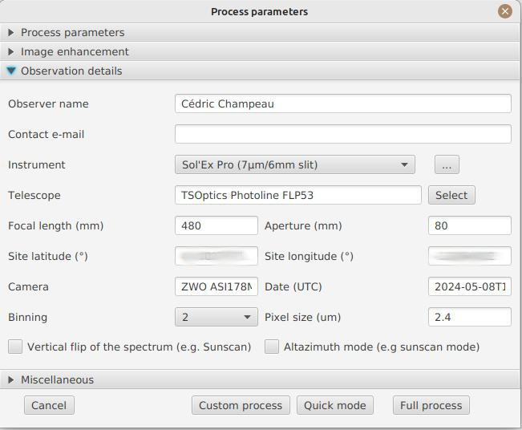

= JSol'Ex
Cédric Champeau
:icons: font
:docinfo: shared

JSol'Ex is a solar images processing software for http://www.astrosurf.com/solex/sol-ex-presentation-en.html[Christian Buil's Sol'Ex].
It is capable of processing SER files captured with this instrument in order to produce images of the solar disk, in a similar way to what http://valerie.desnoux.free.fr/inti/[INTI from Valérie Desnoux] is doing.
It is primarily designed to process images for Sol'Ex, but it might work properly for other kinds of spectroheliographs.

JSol'Ex is free software published under the Apache 2 software license.
It is written in en Java and provided for free without any warranty.

.Note to US citizen and far right supporters
[IMPORTANT]
====
**If you support Trump or any other party close to the far right, I ask you not to use this software.**

My values are fundamentally opposed to those of these parties, and I do not wish for my work, which I have developed during evenings and weekends, and despite it being open source, to be used by people who support these nauseating ideas.

Solidarity, openness to others, ecology, fight against discrimination and inequality, respect for all religions, genders, and sexual orientations are the values that drive me.
I do not accept that my work be used by people who are responsible for suffering and exclusion.
If you do, I kindly ask you to review your choices and turn to more positive values, where your well-being does not come from the rejection of others.
====

== Downloads

Click on the button corresponding to your OS below:

link:https://jsolex.s3.eu-west-3.amazonaws.com/jsolex-windows-latest/{prefixName}-{version}.msi[icon:windows[] JSol'Ex (Windows), role="badge"]
link:https://jsolex.s3.eu-west-3.amazonaws.com/jsolex-ubuntu-latest/{prefixName}_{version}_amd64.deb[icon:linux[] JSol'Ex (Linux), role="badge"]
link:https://jsolex.s3.eu-west-3.amazonaws.com/jsolex-macos-latest/{prefixName}-{version}.pkg[icon:apple[] JSol'Ex (Mac ARM64), role="badge"]
link:https://jsolex.s3.eu-west-3.amazonaws.com/jsolex-macos-13/{prefixName}-{version}.pkg[icon:apple[] JSol'Ex (Mac Intel), role="badge"]

JSol'Ex can also be downloaded or built from source from https://github.com/melix/astro4j/releases[this page].
Installaters are available for Linux, Windows and MacOS.

Alternatively, you may run JSol'Ex by checking out the sources and running the following command:

[source,bash]
----
./gradlew jsolex:run
----

== Processing a video file

JSol'Ex only supports SER files, please make sure to configure your capture software to use this format.
The main window looks like this:

image::main-window-fr.jpg[]

In the "File" menu, choose "Open SER File" and select a file.
The following popup should open:

image::params-1-en.jpg[]

This window is the main entry point for the process parameters.
You can specify:

- the observation bandwidth: while it's not mandatory to select that field, doing so will enable automatic colorization of the images. Should your observation bandwidth not be available in the list, you can add more by clicking on the "..." button.
- Pixel shift : by default, the software will identify the darkest line in the image and model it as a second order polynomial. Then the image is reconstructed by picking the center of the line, which corresponds to a shift of 0. By using a different shift value, you can produce an image which is "off center", for example to produce images of the solar continuum or to select a different wavelength which isn't the darkest, such as when observing in helium for example
- the Doppler shift is only used when you are observing in h-alpha. JSol'Ex will produce a couple more images shifted in one direction and the other in order to produce a Doppler image. By default, a shift of 3 pixels is used but you can override that parameter.
- Rotation : allows performing a left or right rotation (90 degrees) of the images. This can be useful for scans performed in declination, to fix the orientation. This parameter doesn't affect images produced with ImageMath.
- Autocrop : allows automatic cropping of images after geometric transformation. There are multiple modes:
* Off: no autocrop (this is the default)
* Original width: the image will be cropped to a square which width corresponds to the width of the original SER file. Ideal for full solar disks.
* Radius (x...) : the image will be cropped or rescaled to a factor of the determined solar radius. This can be useful for example with truncated disks, if you want to "see" where it would be positioned.
- Autocorrect P angle: when checked, the solar angle P will be computed from the observation date (available in the SER file). The generated images will be automatically corrected so that the North is at the top. This parameter will not affect images generated via ImageMath, which need to perform their own correction.
- Force tilt: the software is fitting an ellipse around the solar disk which is reconstructed, and uses that information to perform geometric correction. It is possible that the tilt detection is wrong, in which case you can force a value.
- Force X/Y ratio: similarly, the X/Y ratio which is detected may be inaccurrate, in which case you can force it to a particular value.
- Force polynomial: this lets you override the detected spectral line, if for some reason it is not detected correctly. See the <<#force-polynomial,section about forcing the polynomial>> for more information.
- Horizontal and vertical inversion let you mirror the image so that you match the North and East as expected in the output images.
- Rescale to full resolution: can be used if your video is oversampled, which typically happens if you are scanning at lower rates (e.g sideral) and that you want to resize the generated image to its full resolution.

WARNING: Enabling full resolution can lead in significantly larger images and very high memory pressure. It is not recommended to enable this flag.

== Image enhancement

This section lets you configure the transformations which will be applied to images in order to improve their aesthetic aspect.

image::params-2-en.jpg[]

- CLAHE parameters : allows configuring the CLAHE contrast improvement algorithm.
It is possible to configure the size of the tiles used to compute histograms, the histogram resolution and the clipping factor.

Next come the banding correction parameters, which allow to correct transversal bands which can appear on images, for example because of dust on the slit.

- Banding correction width: this is the width of the bands which are used in the transversallium correction algorithm. Bands are used to compute the average brightness of pixels in the band, then lines are corrected according the band they belong to.
- Banding correction passes: the more passes you'll apply, the more lines should be corrected, at the cost of lower contrast images

Another section lets you configure image deconvolution.
By default, no deconvolution is applied, but you can choose the deconvolution algorithm and its parameters.

For the Richardson-Lucy deconvolution, you can choose the size of the synthetic PSF, the sigma factor and the number of iterations.

Finally, you can choose to apply a detail enhancement filter at the end of the processing by checking the "sharpen images" box.

[NOTE]
.Experimental
====
The artificial flat correction allows to correct a possible vignetting. It computes a model from the disk pixels. The pixels considered are those whose value is between a low and a high percentile. For example, if you enter 0.1 and 0.9, the pixels whose value is between the 10th and 90th percentile will be used to compute the model. Finally, a polynomial of the specified order is adjusted on the model values to correct the image.
====

== Observation parameters

Observation parameters are used to insert metadata into FITS files.
As of now, we do _not_ recommend to publish images produced using JSol'Ex to the BASS2000 database because the FITS header that this software uses are not validated against what the database expects.

Here are the fields available in JSol'Ex:

- Observer : the person who made the observation
- Email : the email address of the person who made the observation
- Instrument : pre-filled to "Sol'Ex"
- Telescope : your telescope or refractor used with the Sol'Ex instrument
- Focal length and aperture of the telescope
- Latitude and longitude of the observation site
- Camera
- Date : pre-filled with information from the SER file, expressed in the UTC timezone
- Binning : the binning of pixels when the video was recorded
- Pixel size : the size of the camera pixels in microns

== Other parameters

image::params-4-en.jpg[]

- Assume mono video : when checked, JSol'Ex will not try to perform demosaicing of the video, by assuming it's a mono one. This can considerably speedup processing, and because most videos for Sol'Ex will be mono, it is better to leave this checked.
- Automatically save images : if checked, all images which are generated by the software will be saved to disk immediately. If unchecked, then it's your responsibility to save them by clicking on the "save" button of each image tab.
- Generate debug images: when checked, additional images will be generated to highlight edge detection, tilt detection and average image. These can be useful to figure out what when wrong when the software doesn't produce the expected results.
- Generate FITS files : in addition to PNG files, will also generate FITS files.

[[force-polynomial]]
== Force polynomial

JSol'Ex performs detection of the spectral line by looking for the darkest line in the image, then fitting a 3rd order polynomial to it.
Sometimes, detection may be incorrect, in which case you can force a polynomial to be used.

In order to do this, click on the "force polynomial" button, which will let you enter the polynomial coefficients.

The format of the polynomial is a list of 4 numbers between curly braces, separated by commas, for example: `{1.3414109042116584E-10,3.889927699830093E-5,-0.056529799336687114,35.76051527062038}`.

The easiest way to get the polynomial coefficients is to click on the "..." button, which will open a window with the average image and the detected spectral line :

image::force-polynomial-1.jpg[]

You can then press "CTRL" then click on the line to add measurement points: a red cross will be added for each point.
When you have enough points, click on the "Compute polynomial" button, which will fit a 3rd order polynomial to the points and automatically fill the "force polynomial" field in the process parameters:

image::force-polynomial-2.jpg[]

You can then close the popup and start processing.

[[filename-templates]]
== File naming patterns

By default, JSol'Ex will output the generated images in a subfolder which name matches the name of the SER file (without extension). Then each kind of images is stored in a subdirectory of that folder (e.g raw, debug, processed, ...).
If that naming convention doesn't suit you, you can create your own naming patterns, by clicking the "..." dots:

image::params-5-en.jpg[]

A naming pattern consists of a label, but more importantly a pattern consisting of tokens delimited by the `%` character.

Please find below the list of available tokens:

- `%BASENAME%` is the SER file base name, that is to say the name without extension
- `%KIND%` is the kind of images (raw, debug, processed, ...)
- `%LABEL%` is the label of the produced images, e.g `recon`, `protus`
- `%CURRENT_DATETIME%` is the date and time of processing
- `%CURRENT_DATE%` is the date of processing
- `%VIDEO_DATETIME%` is the date and time of the video
- `%VIDEO_DATE%` is the date of the video
- `%SEQUENCE_NUMBER%` is the sequence number in case of batch processing (4 digits, eg. `0012`)

This for example would be a pattern which puts all generated files in a single folder:

`%BASENAME%/%SEQUENCE_NUMBER%_%LABEL%`

The "example" field shows you what the generated file names would look like.

== Process start

JSol'Ex provides 3 processing modes: quick, full and custom.

- The "quick" mode will only produce a couple images: the raw reconstructed one, and a geometry corrected version. It is useful in your initial setup, when you're still trying to figure out the tilt or exposure, for example. It is recommended to combine this mode with not saving images automatically, so that you don't fill your disk with images that you will never use.
- The "full" mode will generate all images that JSol'Ex can automatically produce:
    - the raw, reconstructed image
    - a geometry corrected and color-stretched version
    - a colorized image, if the bandwidth you have selected provides the required parameters
    - a negative image version
    - a virtual eclipse, to simulate a coronagraph
    - a mixed image combining the colorized version with the virtual eclipse
    - a Doppler image
- the "custom" mode will let you precisely pick which images you want to generate. It even provides a more advanced mode letting you script generated images, allowing the generation of images which weren't designed initially (see the <<#custom_images,section about custom images>>).

=== Image display

Once images are generated, they appear one after each other in tabs.
These tabs provide you with the ability to tweak the contrast of images and save them, typically when you unchecked the automatic save option.

image::image-display-fr.jpg[]

It is possible to zoom into the images by using the mouse wheel.
In addition, right-clicking the image will let you open it into your file explorer or in a separate window.

== Watching a directory for changes

When trying to find the ideal focus, it can be useful to process video files quickly until we obtain a satisfying result.
JSol'Ex offers an easy way to do this, by watching the changes in a directory : new videos which are saved in that directory will immediately be processed.

To do this, in the file menu, choose "Watch directory" then select the directory where your SER files will be recorded (e.g the output directory of SharpCap).

JSol'Ex will switch to watch mode, which you can interrupt by clicking the button which appeared in the bottom left of the interface.

Now, open your capture software and record a new video.
Once it's done, switch to JSol'Ex : it will open the process parameters configuration window.
Select your processing parameters then start the processing.

Once you have the result, switch back to your capture software and acquire a new video.
Once its done, switch back to JSol'Ex: this time, the process parameters window won't open, because it's going to reuse the parameters from the first video, allowing to process new videos very quickly!

WARNING: Make sure that when you switch from your capture software to JSol'Ex that the recording is finished. If not, processing can start on an incomplete file and fail.

Once you're happy with the result, click on the "Stop watching" button on the bottom left.

TIP: You can combine the watch mode with opening an image in a new window (by right-clicking on an image, you can open it in a new window). When a new SER file will be processed, the corresponding image will automatically replace the one in the external window. This can be useful in demonstrations, if you have for example a separate monitor where you would only show the result of processing.

[[custom_images]]
== Customization of generated images

When you click the "custom" mode instead of the quick or full ones, JSol'Ex provides you with an interface which will let you declare exactly what should be output.

There are 2 modes available: the _simple_ one and the _ImageMath_ one.

In the simple one, you can pick which images to generate by clicking the right boxes.
It is also possible to ask for the creation, in parallel, of images at different pixel shifts.

For example, should you want to generate images from the continuum to the observed ray, you can enter `-10;-9;-8;-7;-6;-5;-4;-3;-2;-1;0;1;2;3;4;5;6;7;8;9;10` which will have the consequence of generating 21 distinct images ranging from shift -10 to +10.
This can be particularly useful if you want, for example, to generate an animation.

It's worth noting that if you check some images like "Doppler", some pixel shifts will be automatically added to the list (e.g -3 and +3).

If this isn't good enough for you, you can go even more advanced by enabling the "ImageMath" mode which is extremely powerful while relatively simple to grasp.

[[imagemath]]
== ImageMath : images generation scripts
=== Introduction to ImageMath

The "ImageMath" mode is a mode which will let you declare which images to generate by writing small scripts.
It relies on a simple script language designed specifically for generating Sol'Ex images.

Let's illustrate this by going back to our previous example, where you wanted to generate images in the [-10;10] pixel shift range.
In the "simple" mode, you had to manually enter all pixel shifts, which can be a little cumbersome.
In the "ImageMath" mode, we have a language which will let us to this with a single instruction.

First, select the `ImageMath` mode in the select box and click on "Open ImageMath".
The following interface show up:

image::imagemath-1-fr.jpg[]

On the left side, "Scripts to execute", you will find the list of all scripts which will be applied in your session.

WARNING: This is really the list of scripts which are _applied_ in that session, not the list of available scripts! Click on the "remove" button to remove scripts from execution in the session.

Scripts must be saved on your local disk and can be shared with other users.
Their contents is editable in the rightmost part of the interface.

Start with removing the contents of the sample script and replace it with:

[source]
----
range(-10;10)
----

Then click on "Save".
Select a destination file and proceed: the script is now added to the list on the left, as being executed in this session.

Click on "Ok" to close ImageMath and only keep the "geometry corrected (stretched)" images.
Click on "Ok" to start processing, you will now have the 21 required images generated:

image::imagemath-2-fr.jpg[]

=== Functions available in ImageMath

For now we've only used one function called `range`, which let us generate about 20 images, but there are many others available.

Base functions:

- `img` requests an image at a particular pixel shift. For example, `img(0)` is the image centered on the detected spectral ray, while `img(-10)` is a continuum image, shifted 10 pixels up.
- `list` builds a list from its arguments. e.g `list(img(-3), img(3))`
- `get_at` retrieves an image from the list. For example, `get_at(list(img(-3), img(3)), 1)` will return the image at index 1, which is `img(3)`. In case the argument is a list of list of images, then it will return a list which consists of the images at the specified index.
- `avg` computes the average of different images. For example: `avg(img(-1), img(0), img(1))` computes the average of images at pixel shifts -1, 0 and +1. It is also possible to use the simpler `avg(range(-1,1))` expression
- `max` computes the maximum of multiple images, for example `max(img(-3), img(3))`. Maximum is per pixel.
- `min` computes the minimum of multiple images, for example `min(img(-3), img(3))`. Minimum is per pixel.
- `range` generates images in a certain range of pixel shifts. It accepts either 2 or 3 arguments. The first 2 are the lower and higher pixel shifts (included). The 3rd, optional one is a step value. For example, using `range(-5;5;5)` will only generate 3 images at pixel shifts -5, 0 and 5.
- `pow` computes the power of an image. For example: `pow(img(0), 2)` will square the image.
- `log` computes the logarithm of an image. For example: `log(img(0), 2)` will compute the base 2 logarithm of the image.
- `exp` computes the exponential of an image. For example: `exp(img(0))` .

You can also perform calculus with images, for example:

`(img(5)+img(-5))/2` which is equivalent to `avg(img(5),img(-5))`.

Another example: `0.8*img(5) + 0.2*avg(range(0;10))`

Other functions are available:

- `adjust_gamma` applies a gamma correction to an image. It accepts 2 arguments: the image and the gamma value. For example: `adjust_gamma(img(0), 2.2)`. A gamma value < 1 will lighten the image, while a value > 1 will darken it.
- `auto_contrast` is a contrast enhancement function which is designed specifically for Sol'Ex images. It combines several techniques to enhance the contrast of the image. It accepts 2 arguments: the image and an enhancement factor. For example: `auto_contrast(img(0), 1.5)`. The enhancement factor is a value starting from 1. The higher the value, the stronger the contrast enhancement.
- `invert`, generates a color inverted image
- `clahe` performs https://en.wikipedia.org/wiki/Adaptive_histogram_equalization#Contrast_Limited_AHE[Contrast Limited Adaptative Histogram Equalization] on your image. It supports either 2 or 4 parameters. In the first form, it takes the image to equalize and clip factor, for example: `clahe(img(0); 1.5)`. In the long form, it takes 2 additional parameters which are the tile size (used to compute histograms) and the number of bins (the lower, the smaller the dynamic range). e.g `clahe(img(0); 128; 256; 1.2)`
- `adjust_contrast` applies simple contrast adujstment by clipping values under the minimal value or above the maximal value. e.g `adjust_contrast(img(0), 10, 210)`. The range is must be between 0 and 255.
- `asinh_stretch` applies the inverse arcsin hypobolic transformation to increase contrast. It accepts 3 arguments: the image, the black point value and a stretch value.
- `linear_stretch` expands the image dynamic range. It takes either one or 3 arguments: the image and optionally the minimal and maximal value. The min/max values are used to determine to what range to expand. It's a 16-bit value between 0 and 65535. For example: `linear_stretch(img(0))`
- `fix_banding` applies the banding correction algorithm. It accepts 3 arguments: the image, the banding width, the number of passes. For example, `fix_banding(img(0), 10, 5)`.

NOTE: If you don't want to provide a custom black point value, you can use a predefined one, which is estimated from the image. It is available as the `blackPoint` variable, e.g  `asinh_stretch(img(0), blackPoint, 100)`

- `crop` will perform arbitrary cropping of an image. This function takes 5 parameters: the coordinates of the top left point, then the width and height of the desired image. For example: `crop(img(0), 100, 100, 300, 300)`.
- `crop_rect` crops the image do the specified dimensions, with the guarantee that the center of the sun disk will be in the center of the new image. For example: `crop-rect(img(0), 1024, 1024)`. This doesn't perform any scale change: if the target image cannot fit the solar disk, it will be truncated.
- `autocrop` will perform a square cropping of the image. It makes use of the detected ellipse to center the image on the sun center. e.g `autocrop(img(0))`.
- `autocrop2` will perform a square cropping of the image, centered on the solar disk, similarly to `autocrop`, but the dimensions of the cropped image are calculated with a factor of the disk diameter. By default, dimensions of the cropped image are a multiplier of 16. e.g `autocrop2(img(0);1.1)` will crop around 1.1 times the diameter. `autocrop2(img(0);1.1;32)` will do the same, but the resulting image will have width and height as multipliers of 32.
- `colorize` triggers colorization of the image. It either takes 2 parameters, the image and a profile name, or 7 parameters. The profile name is the name of the color profile as found in the process parameters. For example: `colorize(img(0), "h-alpha"). The long version takes the image and for each RGB color channel, the "in" and "out" values determining the color curves, in the 0..255 range. e.g `colorize(img(0), 84, 139, 95, 20, 218, 65)` is strictly equivalent to the `h-alpha` version. It's worth noting that colorizing is highly sensitive to the source pixel values. It may be required to run an `asin_stretch` function before colorizing.
- `remove_bg` performs background removal on an image. This can be used when the contrast is very low (e.g in helium processing) and that stretching the image also stretches the background. This process computes the average value of pixels outside the disk, then uses that to perform an adaptative suppression depending on the distance from the limb, in order to preserve light structures around the limb. For example: `remove_bg(stretched)`. Another variant lets you specify a tolerance value: `remove_bg(stretched, 0.2)`. The lower the tolerance, the weaker the correction will be.
- `rgb` creates an RGB image by associating mono images on the respective R, G and B channels. As a consequence it accepts 3 parameters, for exemple: `rgb(img(3), avg(img(3), img(-3)), img(-3))`.
- `get_r`, `get_g` and `get_b` functions extract respectively the red, green or blue channel of a color image. If a mono image is passed, the mono image is returned directly.
- `mono` converts a color image to mono, by extracting channels and applying the formula grey=0.299 * R + 0.587 * G + 0.114 * B
- `neutralize_bg` is a function similar to `remove_bg` which uses a polynomial background modeling to neutralize the background and remove gradients. It takes an image as the first argument, and optionally a number of iterations as the second argument. e.g: `neutralize_bg(img(0), 2)`
- `saturate` (de)saturates an RGB image. It takes 2 arguments : an RGB image and a saturation factor (relative to the current image saturation). e.g: `saturate(doppler, 2)`.
- `anim` allows the creation of MP4 files from your individual frames. It takes a list of images as the first parameter, and an optional delay (default 250ms) between frames as 2d parameter. e.g `anim(range(-5;5))`. Warning: animation creation is a resource intensive operation.
- `load` loads an image from the file system. It takes the path to the file as an argument. For example: `load("/path/to/some/image.png")`. Instead of using an absolute path, it is possible to use `workdir` in combination.
- `load_many` allows loading several images at once from a directory. For example: `load_many("/path/to/folder")`. An optional parameter lets you specify a regular expression to filter images: `load_many("/chemin/vers/dossier", ".\*cropped.*")`.
- `choose_file` lets the user select an image file. It will open a file chooser dialog with a help message that you provide. The function requires 2 arguments: an id and the message. The id is used to remember the last directory with was used when calling this function. For example: `choose_file("myImage", "Please select an image")`. The message cannot be empty.
- `choose_files` lets the user select multiple image files. It will open a file chooser dialog with a help message that you provide. The function requires 2 arguments: an id and the message. The id is used to remember the last directory with was used when calling this function. For example: `choose_files("myImage", "Please select some images")`. The message cannot be empty.
- `workdir` sets the default working directory, which is used whenever the `load` operation is done with relative paths. e.g `workdir("/path/to/session")`
- `rl_decon` applies theRichardson-Lucy deconvolution algorithm to the image. This function makes use of a synthetic PSF. It requires a single mandatory parameter which is the image to process. For example: `rl_decon(img(0))`. 3 optional parameters are available: the PSF radius in pixels, the sigma factor and the number of iterations. For example: `rl_decon(img(0), 2.5, 2.5, 10)`.
- `sharpen` will apply sharpening the target image. For example, `sharpen(img(0))`.
- `blur` will apply Gaussian blur the target image. For example, `blur(img(0))`.
- `disk_fill` will fill the detected sun disk with a fill color (by default, the detected black point). e.g `disk_fill(img(0))` or `disk_fill(img(0), 0)`.
- `disk_mask` creates an image mask, where pixels within the solar disk have value 1 and these outside the disk have value 0. It is possible to invert (0 within, 1 outside) by passing `1` as the second argument. For example: `disk_mask(img(0);1)`.
- `rescale_rel` rescales an image. It accepts 3 arguments: the image, then the scaling factors for X and Y. For example, `rescale_rel(img(0);2;2)` will double the size of an image.
- `rescale_abs` rescales an image to the specified dimensions. It takes 3 arguments: the image then the desired width and height. For example, `rescale_abs(img(0);2048;2048)`.
- `radius_rescale` is a relative scaling method which can facilitate mosaic composition. It will therefore most likely be used in <<#batch-mode,batch mode>>. It allows rescaling a set of images so that they all have the same solar disk radius (in pixels). In order to do so, it will perform an ellipse regression against each image to compute their solar disk, then will rescale all images to match the radius of the largest one. For example: `radius_rescale(cropped)`.

Rotation functions:

TIP: A special variable named `angleP` contains the computed solar P angle, from the observation details. It is expressed in radians and can typically be used with the `rotate_rad` function to perform correction.

- `rotate_left` performs a rotation of the image to the left. For example, `rotate_left(img(0))`.
- `rotate_right` performs a rotation of the image to the right. For example `rotate_right(img(0))`.
- `rotate_deg` performs an arbitrary rotation, in degrees. It accepts between 2 and 4 parameters: the image and the rotation angle are mandatory. For example: `rotate_deg(img(0), 45)`. You can then specify the fill value for the pixels which didn't belong to the original image:  `rotate_deg(img(0), 45, 800)` and last, if you add `1` as the last argument, the image will be rescaled so that all pixels from the original image are found in the rotated version.
- `rotate_rad` performs an arbitrary rotation, in degrees. It accepts between 2 and 4 parameters: the image and the rotation angle are mandatory. For example: `rotate_rad(img(0), 0.25)`. You can then specify the fill value for the pixels which didn't belong to the original image:  `rotate_rad(img(0), 0.25, 800)` and last, if you add `1` as the last argument, the image will be rescaled so that all pixels from the original image are found in the rotated version.
- `vflip` flips the image vertically. For example: `vflip(img(0))`.
- `hflip` flips the image horizontally. For example: `hflip(img(0))`.

Decorative functions

- `draw_globe` draws a globe which orientation and diameter matches the detected solar parameters. It takes between 1 and 4 arguments. The 1st one is the image on which to draw the globe. e.g: `draw_globe(img(0))`. The next, optional parameters are the P angle (in radians), the B0 angle (in radians) and the ellipse. e.g: `draw_globe(img(0), p, b0, ellipse)`.
- `draw_obs_details` prints on the image the observation details. For example: `draw_obs_details(img(0))`. By default, placed in the top left corner. It's possible to set the (x,y) position explicitly: `draw_obs_details(img(0), 100, 100)`.
- `draw_solar_params` prints on the image the detected solar parameters. For example: `draw_solar_params(img(0))`. By default, placed in the top right corner. It's possible to set the (x,y) position explicitly, for example: `draw_solar_params(img(0), 500, 100)`.
- `draw_text` draws a text on the image. It takes 3 mandatory arguments: the image, the position where to print the text, the text to draw. For example: `draw_text(img(0), 100, 100,"Hello World")`. It also accepts 2 optional parameters: the font size and the color. For example: `draw_text(img(0), "Hello World", 100, 100, 24, "ff0000")`. The color is a 6-digit hexadecimal value. NOTE: if you specify a color, then the image will be automatically converted to RGB. If the text is surrounded with `\*` then it will be printed in bold (e.g `draw_text(img(0), "\*Hello World*", 100, 100)`). If the text is surrounded with `\_` then it will be printed in italic (e.g `draw_text(img(0), 100, 100, "\_Hello World_")`).
- `draw_arrow` draws an arrow on the image. It takes 5 mandatory arguments: the image, the start and end points of the arrow. For example: `draw_arrow(img(0), 100, 100, 200, 200)`. It also accepts 2 optional parameters : the thickness of the arrow and the color. For example: `draw_arrow(img(0), 100, 100, 200, 200, 2, "ff0000")`. The color is a 6-digit hexadecimal value. NOTE: if you specify a color, then the image will be automatically converted to RGB.
- `draw_circle` draws a circle on the image. It takes 4 mandatory arguments: the image, the center of the circle and the radius. For example: `draw_circle(img(0), 100, 100, 50)`. It also accepts 2 optional parameters : the thickness of the circle and the color. For example: `draw_circle(img(0), 100, 100, 50, 2, "ff0000")`. The color is a 6-digit hexadecimal value. NOTE: if you specify a color, then the image will be automatically converted to RGB.
- `draw_rect` draws a rectangle on the image. It takes 5 mandatory arguments: the image, the top left corner of the rectangle, the width and height. For example: `draw_rect(img(0), 100, 100, 50, 50)`. It also accepts 2 optional parameters : the thickness of the rectangle and the color. For example: `draw_rect(img(0), 100, 100, 50, 50, 2, "ff0000")`. The color is a 6-digit hexadecimal value. NOTE: if you specify a color, then the image will be automatically converted to RGB.
Stacking and mosaic functions:
- `draw_earth` draws the Earth on the image, scaled accordingly to the solar disk. This function takes 3 parameters: the image and the coordinates (x,y) where to draw the Earth. For example: `draw_earth(img(0), 100, 100)`.

- `stack` allows stacking images together. It will align images and compute the median value of each pixel. It accepts 1 to 4 parameters. The first one is the list of images to stack, for example: `stack(load_many("\*.fits"))`. The 2d parameter is the tile size. The 3rd one is the sampling factor (>0). For example, if the sampling factor is 0.5 and the tile size is 32 pixels, then a sample will be picked every 16 pixels. The 4th parameter is the reference selection method, which is one of `first` (first image of the list), `sharpness` (the sharpest image), `average` (computes the average of all images), `median` (computes the median of all images) or `eccentricity` (chooses the image which is closest to a circle). For example: `stack(load_many("\*.fits"), 32, 0.5, "sharpness")`. The default reference selection method is `sharpness`.
- `stack_ref` takes 2 parameters: a list of images and a reference selection method. It then returns an image which can be used as a reference for stacking. The selection methods are the same as for `stack`. For example: `stack_ref(load_many("\*.fits"), "sharpness")`.
- `mosaic` allows stitching images together in order to create a mosaic. It accepts 1 to 3 parameters. The first one is the list of images to stack, for example: `mosaic(load_many("*.fits"))`. The 2d parameter is the tile size and the 3rd one is the sampling factor (>0).
- `dedistort` allows to correct the distortion of an image. It has 2 distinct modes of operation. In the first mode, you provide it with a reference image and an image to correct, as well as 3 optional parameters: the tile size, the sampling and the sky background value. For example: `dedistort(ref, img(0), 32, 0.5, 0)`. The returned image will be corrected as much as possible to match the reference image, making it for example usable for stacking. In the second mode, you provide it with a list of images to correct (1st parameter) and a list of already corrected images (2nd parameter), in which case the correction parameters of each image are taken using the image at the same index in the list of already corrected images. This can be useful for example when you calculate the distortion in the middle of the ray (shift 0) and you want to apply the same corrections to images with different shifts. For example: `dedistort(images, corrected)`.
- `continuum` est une fonction sans paramètre qui détermine automatiquement une image de type "continuum" qui peut par exemple être soustraite d'une autre image. Cette fonction diffère de l'image continuum classique au sens où il ne s'agit pas d'une image unique calculée à la différence de pixels fixe de 15 pixels, mais d'une image calculée à partir de la médiane d'un ensemble d'images. Utilisation: `continuum()`.

Analysis functions:

- `find_shift` allows to compute a pixel shift from the detected ray. It accepts a single parameter, the name of the ray to search for, for example, `find_shift("Helium (D3)"), or the wavelength in Angström, for example `find_shift(5875.62)`. This function returns a number, the pixel shift.
- `continuum` is a function without parameters which automatically determines a "continuum" image which can for example be subtracted from another image. This function differs from the classic continuum image in the sense that it is not a single image calculated from a fixed pixel difference of 15 pixels, but an image calculated from the median of a set of images. Usage: `continuum()`.

Filtering:

The `filter` function can be used on a list of images to keep these which match a particular criteria.
This can be particularly useful in batch mode.
For example, you may want to perform a vertical and horizontal flip to images after a certain time, because of meridian flip.

The `filter` function accepts 4 arguments:

1. the list of images to filter
2. the subject of the filtering
3. the operator
4. the criteria

For example, to create a list of images for which the time is after 12:00, you can use the following call: `filter(images, "time", ">", "12:00:00")`.

|===
|Subject|Description|Available operators|Example

|`file-name`|The name of the SER file|`=`, `!=`, `contains`, `starts_with`, `ends_with`|`filter(images, "file-name", "contains", "2021-06-01")`
|`dir-name`|The name of the directory which contains the SER file|`=`, `!=`, `contains`, `starts_with`, `ends_with`|`filter(images, "dir-name", "contains", "2021-06-01")`
|`pixel-shift`|The pixel shift of the image|`=`, `!=`, `>`, `<`, `>=`, `<=`|`filter(images, "pixel-shift", ">", 0)`
|`time`|The time of the acquisition (compared in UTC)|`=`, `!=`, `>`, `<`, `>=`, `<=`|`filter(images, "time", ">", "12:00:00")`
|`datetime`|The date and time of the acquisition (compared in UTC)|`=`, `!=`, `>`, `<`, `>=`, `<=`|`filter(images, "datetime", ">", "2021-06-01 12:00:00")`
|===

Special functions:

- `sunspots_overlay` generates an overlay of the detected sunspots. It accepts a single parameter: the image on which to draw the overlay. This feature will only work if sunspots image generation has been selected. For example: `sunspots_overlay(continuum())`.
- `crop_sunspots` takes a single image and generates a list of images, each one cropped around a detected sunspot. For example: `crop_sunspots(continuum())`. It accepts 2 optional parameters which are the minimal size of the sunspot, in pixels and a margin in %. For example: `crop_sunspots(continuum(), 10, 20)`. The default size is 32 pixels.

Miscellaneous functions:

- `sort` sorts a list of images. It accepts a list of images as the first argument and a sort criteria as the second one. For example: `sort(images, "date")`. The default criteria is `shift` for the pixel shift. It is possible to reverse the order by using `desc`, for example `sort(images, "date desc")`.
- `video_datetime` returns the formatted datetime of an image. It accepts one or two parameters: the image and an optional format. For example: `video_datetime(img(0))` or `video_datetime(img(0), "yyyy-MM-dd HH:mm:ss")`

=== ImageMath scripts

In the previous section, we have seen the building blocks of ImageMath, which permit computation of new images.
Scripts go beyond this by combining these into a powerful tool to generate images.
As an illustration, let's look at this script which will let us generate an Helium image.
Helium image processing is complicated, because the Helium ray is very dim and the software cannot find it in the image.
Therefore, we can use a technique which consists of taking a larger capture window which includes a dark ray, then by determining by how many pixels the helium ray is shifted from that line, we can reconstruct an image.
Even so, the work is not finished, since it's an extremely low contrast ray, so we have to substract the continuum value.
Producing such images is quite cumbersome but can be simplified to the extreme with ImageMath:

[source]
----
[params]
# The shifting between the helium line and the detected line (in pixels)
Line=5875.62
HeliumShift=find_shift(Line)
# Banding correction width and number of iterations
BandWidth=25
BandIterations=20
# Contrast adjustment
Gamma=1.5
# Autocrop factor (of diameter)
AutoCropFactor=1.1

## Temporary variables
[tmp]
helium_raw = img(HeliumShift) - continuum()
helium_fixed = fix_banding(helium_raw;BandWidth;BandIterations)
cropped = autocrop2(auto_contrast(helium_fixed;Gamma);AutoCropFactor)

## Let's produce the images now!
[outputs]
helium_mono = cropped
helium_color = colorize(helium_mono, Line)
----

Our script consists of 3 different sections: `[params]`, `[tmp]` and `[outputs]`.
The only mandatory section is the `[outputs]` one: it defines which images we want to have in the end.
The name of all other sections is arbitrary, you can create as many sections as you want.

Here, we defined a `[params]` section which highlights which parameters we want users to be able to tweak for their needs.
This is where we find the value of our helium ray pixel shift (`HeliumShift=find_line(Line)`) which is computed from the `Line=5875.62` variable declaration.

NOTE: A variable can only contain ASCII characters, digits (except for the 1st character) or the `_` character. For example, `myVariable`, `MyVariable` or `MyVariable0` all all valid identifiers. `hélium` is invalid (because of the accent).

Variables can be used in other variables or function calls.

IMPORTANT: Variables are case sensitive. `myVariable` et `MyVariable` are 2 distinct variables!

Our 2d section, `[tmp]`, defines intermediate images we want to work with, but for which we don't care about seeing the result:

- `helium_raw` is the Helium ray image, shifted from the detected ray and from which we have subtracted the continuum image.
- `helium_fixed` is the `helium_raw` image to which we have applied the banding correction algorithm.
- `cropped` is the `helium_fixed` image to which we have applied an autocrop and a contrast adjustment.

Last but not least, the `[outputs]` section declares the images we want to generate:

- `helium_mono` is the `cropped` image as is, in black and white.
- `helium_color` is the `helium_mono` image to which we have applied a colorization.

NOTE: Comments can be added either with the `#` or `//` prefix.

[[batch-mode]]
== Batch processing

In addition to single SER file processing, JSol'Ex provides a batch mode.
In this mode, several videos are processed in parallel, which can be extremely useful if you want to generate many images to be used in external software like AutoStakkert!.

To start a batch, in the file menu, choose "batch mode".
Select all the files you want to process (they need to be in the same directory), then the same parameters window as in the single mode will pop up.
This window will let you configure the batch processing, but there are subtle differences:

- you can only select a single ray for all videos, they must all be the same
- the "automatically save images" parameter is always set to `true`
- images will not show up in the interface, but will be shown in a table instead

image::batch-mode-fr.jpg[]

The file list for each SER file will include the log file for each video, as well as all generated images for that SER file.

NOTE: In batch mode, we recommend that you pick a custom <<#filename-templates,file name template>> which will output all images in a single directory: using the sequence number, this will make it easier to import into 3rd party software.

=== ImageMath extensions available in batch mode

When you are in batch mode, an additional section is available in <<#imagemath,ImageMath scripts>>.
This section allows making computations on the results of the processing of each individual image, in order to compose a final image for example (e.g stacking), or to create an animation of several images.

This section must appear at the end of a script and is introduced by the `\[[batch]]` delimiter:

[source]
----
#
# Performs (simple) stacking of images in batch mode
#

[params]
# banding correction width and iterations
bandingWidth=25
bandingIterations=3
# autocrop factor
cropFactor=1.1
# contrast adjustment
clip=.8

[tmp]
corrected = fix_banding(img(0);bandingWidth;bandingIterations) # <1>
contrast_fixed = clahe(corrected;clip)                         # <2>

[outputs]
cropped = autocrop2(contrast_fixed;cropFactor;32)              # <3>

# This is where we stack images, simply using a median
# and assuming all images will have the same output size
[[batch]]                                                      # <4>
[outputs]
stacked=sharpen(median(cropped))                               # <5>
----
<1> For each SER file, we compute an intermediate corrected image (not stored on disk)
<2> We perform contrast adjustment on the corrected images
<3> Important for stacking: we crop the image to a square centered on the solar disk. The square has a width rounded to the closest multiple of 32 pixels. This is the output of each individual SER file processing.
<4> We declare a `\[[batch]]` section to describe the outputs of the batch itself
<5> An image called `stacked` will be calculated by using the median value of each individual `cropped` image

It is important to understand that only the images which appear in the `[outputs]` section of the individual file processing are available for use in the `\[[batch]]` section.
Therefore, the `cropped` image of a single SER file becomes a _list_ of images in the `\[[batch]]` section.
Some functions, like `img` are not available in the `batch` mode.
If you need individual images to be available in the batch processing section, then you must assign them to a variable in the `[outputs]` section:

[source]
----
[outputs]
frame=img(0)       # <1>

[[batch]]
[outputs]
video=anim(frame)  # <2>
----
<1> In order to make the `img(0)` image visible to the batch section, we must assign it to a variable that we call `frame`
<2> An animation is created using each `frame`

=== Standalone scripts

An additional way to benefit from scripting is to reuse the results of previous sessions (typically, images produced in one or many previous sessions) without having to process a new video.

To do so, you must open the "Tools" menu and select "ImageMath editor".
The interface which pops up is exactly the same as when you are processing a single video, or a batch of files.
The main difference is how images are loaded.
In this mode, you must use either the `load` or the `load_many` function to load images, instead of the `img` function.

IMPORTANT: If you use this mode, it is important to load images saved in previous sessions with the FITS format. These files include metadata such as the detected ellipse (solar disk), process parameters, etc. which will permit applying the same functions as you do in a standard processing session.

== Measurements
=== Redshift Measurements

If you process an H-alpha image, JSol'Ex can automatically search within the image for regions where the _redshift_ (red or blue shift) is particularly strong.

To do this, you must either select the "complete" mode during processing or check the "Redshift Measurements" box in the custom image selection.

The measurements will be valid **only** if the specified pixel size is correct **and** you are using a Sol'Ex (other spectroheliographs have different focal lengths).

During processing, an additional image will be generated with the regions outlined in red and the associated speed.

Additionally, if you select the debug images, the parts of the spectrum that allowed finding these regions will be displayed.

Finally, once the detection is complete, you can generate 2 new types of renderings by going to the "Redshift" tab:

image::redshift-tab.jpg[]

The size corresponds to the minimum size of the region to capture, in pixels.
A small region will be centered around the detected filament, but it may be quite pixelated in some cases.
The margin allows you to choose how many pixels to offset from what JSol'Ex detected.
For example, JSol'Ex might find a maximum shift of 20 pixels, but you may wish to add 2 or 4 pixels of margin for an animation to clearly see the filament appear.

Finally, select the type of rendering:

- Animation: generates a video where each frame is shifted by 0.25 pixels
- Panel: generates a single image, a panel where each cell corresponds to a different pixel shift

image::pixel-shift-panel.jpg["Example of panel"]

=== Measurements thanks to the video analyzer

JSol'Ex provides a tool which will let you see what the detected spectral line is for a particular video.
This tool chan be used, for example, to efficiently determine the pixel shift to apply when processing an Helium video.

To do this, open the "Video analyzer" in the "Tools" section.
Select a video, the tool will compute the average image then show this window:

image::spectral-debug-1-fr.jpg[]

In the upper side you can see the reconstructed average image.
The red line is the detected spectral ray, which is built by figuring out the darkest points of the lines.
Below the violet line, you can see a _geometry corrected_ version of the average image.
If the line was properly detected, then the corrected image should show you perfectly horizontal lines.

In the lower part of the interface, you can adjust several parameters:

- the "average"/"frames" radio buttons will let you choose between displaying the average image or the individual video frames
- the sun detection threshold is a parameter you should avoid changing, since the software is not designed to override it in any case. It is provided for advanced debugging in case of bad recognition.
- the "lock polynomial" checkbox will let us lock the current "red line" (a 2d order polynomial) as the one to use in all frames for display. We will use it in the helium ray spectral search below.
- the "contrast" slider does what it says

=== Example of application to determine the helium ray pixel shift

We assume that we have a _single_ SER file which window includes both the helium ray and another ray (e.g sodium) which is dark enough to be detected by JSol'Ex.

We can then proceed by steps:

- first, lock the polynomial on the average image

image::spectral-debug-2-fr.jpg[]

- select the "Frames" mode

image::spectral-debug-3-fr.jpg[]

- Adjust contrast to make the spectrum very bright

image::spectral-debug-4-fr.jpg[]

- Select a frame which is close to the sun limb

image::spectral-debug-5-fr.jpg[]

We can now perform measurements: when you are moving the mouse over the image, coordinates are displayed:

image::spectral-debug-6-fr.jpg[]

The first 2 numbers are the (x,y) coordinates of the point below the cursor.
The 3rd one is the one we're interested in: it's the pixel shift between the cursor position and the detected spectral line (in red).
The 4th number will let us increase our accuracy by computing an average value from samples.

To add a sample, find a point on the helium line then click on it while holding the CTRL key.
You can add as many sample points as you wish.

image::spectral-debug-7-fr.jpg[]

The 4th number is the average of distances and should be a good value to use in your ImageMath scripts.
**In this example we deduce that the pixel shift is -134**.

[[stacking-and-mosaic]]
== Stacking and mosaic composition

JSol'Ex provides a tool to stack images and create mosaics.
The 2 tools are very similar, but stacking is easier to use.
Stacking consists of taking several images of a similar region of the sun and making a single image by aligning the details and averaging the pixels.
Mosaics are similar, but they are used to create a single image from several images of different regions of the sun.

The 2 tools are available in the "Tools" menu, then "Stacking and mosaic composition".

The following window will show up:

image::stacking-1-en.jpg[]

On the left, you can create image panels to stack.
If you create a single panel, it will be a simple stacking.
If you create several panels, each panel will be stacked, then a mosaic will be composed.
A single panel can contain several images, which will be stacked together.
To add a panel, click on the "+" button and select the images to stack.
Alternatively you can drag and drop one or several images from your file explorer.

image::stacking-2-en.jpg[]

In the image above, we have created 2 panels.
The first one contains 3 images which will be stacked to make the north panel, and the second one contains 2 images which will be stacked to make the south panel.

Stacking parameters are visible on the right.
It is not recommended to change them, unless you know what you're doing.
The following options are available:

- the tile size allows to cut the image in tiles for stacking. The smaller the tile size, the more precise the stacking will be, but the longer it will take and the less likely it will be able to compensate for large shifts between images.
- the sampling factor determines where samples will be picked when computing the distorsion model. A sampling factor of 0.5 combined with a tile size of 32 means that a sample will be picked every 16 pixels.
- Forcing the computation of ellipses can be useful if the images you import come from another software or if the ellipses were badly detected. In that case, we will recompute them before stacking.
- Geometry correction should be applied on images which weren't corrected before (e.g raw images).

The post-processing script is an `ImageMath` script that you can apply on each of the tiles after stacking.

NOTE: In a post-processing script, the stacked image is available as `image`. For example, you can create a script which will apply a deconvolution using the formula `rl_decon(image)`.

The other available options let you choose how files are saved.
If you have created more than one panel, then the mosaic options become available.

WARNING: For mosaic composition to work, it is recommended to use `raw` or `recon` images, not `stretched` ones. Indeed, stretched images are more difficult to align.

image::stacking-3-en.jpg[]

Should you only want to stack images without creating a mosaic, you can disable the "Create mosaic" option.
In the other case, you can tweak some parameters, but it is strongly recommended not to change them unless the images you get after sticking are deformed or not reconstructed at all.

Again, you can apply a post-processing script to the mosaic.

== Optimal exposure calculator

In the "tools" menu, you will find the optimal exposure calculator.
This calculator will determine the optimal exposure time, in order to achieve a perfectly circular sun disk and avoid undersampling.

Enter the following parameters:

- the camera pixel size (in microns) and the binning
- the focal length of your instrument
- the scan speed (a multiple of sideral speed, e.g 2, 4, 8, ...)
- the observation date

The software will then automatically compute the recommended framerate and the optimal exposure time in milliseconds.

Note that you can change the type of spectroheliograph used, which can change the calculation of the optimal exposure.

== Spectrum Browser

The Spectrum browser is available in the "Tools" menu.
It allows you to visualize the aspect of the spectrum as it would be seen in capture software such as SharpCap or FireCapture.

image::spectrum-browser-1.jpg[]

In the "Wavelength" box, you can enter a wavelength in Angstroms.
By clicking "Go" or pressing enter, the spectrum will automatically center around this wavelength:

image::spectrum-browser-2.jpg[]

A blue dashed line is added, allowing you to clearly identify the line.

Alternatively, you can directly search for a notable spectral line by selecting it in the box next to the "Go" button.

When you click "Colorize", the spectrum is then colorized to give you an idea of where you are in the visible spectrum (however, we recommend staying in grayscale to precisely identify a line):

image::spectrum-browser-3.jpg[]

On the second line, you have the option to choose the spectroheliograph that is used (this will affect the calculated spectral dispersion), as well as to specify the pixel size (remember to multiply by the binning).

If you check the "Adjust Dispersion" box, the spectrum's dimension is automatically adjusted to precisely match the calculated dispersion per pixel.

You can zoom either by clicking the "+" and "-" buttons, or more simply by pressing "CTRL" and scrolling your mouse wheel.
If you zoom, the automatic adjustment is disabled (since it no longer corresponds to the exact dispersion per pixel).

=== Automatic Identification

Finally, JSol'Ex offers an experimental feature: you can click the "Identify" button to open a file selection window.

Then choose an image of the spectrum, as captured by your software.
JSol'Ex will then try to find out which part of the spectrum it is in:

image::spectrum-browser-4.jpg[]

If the identification works, your image will be displayed in transparency, overlaid on the spectrum, on the left side of the image, allowing you to easily verify if the identification was successful.

You can hide the transparent image by clicking the "Hide" button.

== Acknowledgements

- Christian Buil for designing Sol'Ex and leading the community with great expertise
- Valérie Desnoux for her remarkable work on INTI
- Jean-François Pittet for his bug reports, test videos, and geometric correction formulas
- Sylvain Weiller for his intensive beta-testing, valuable feedback, and processing ideas
- Ken M. Harrison for improved exposure time calculations
