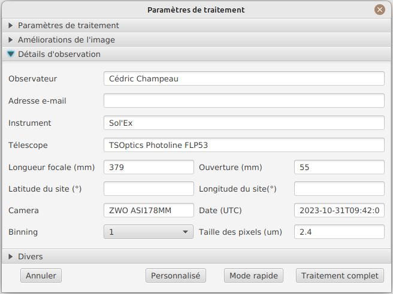
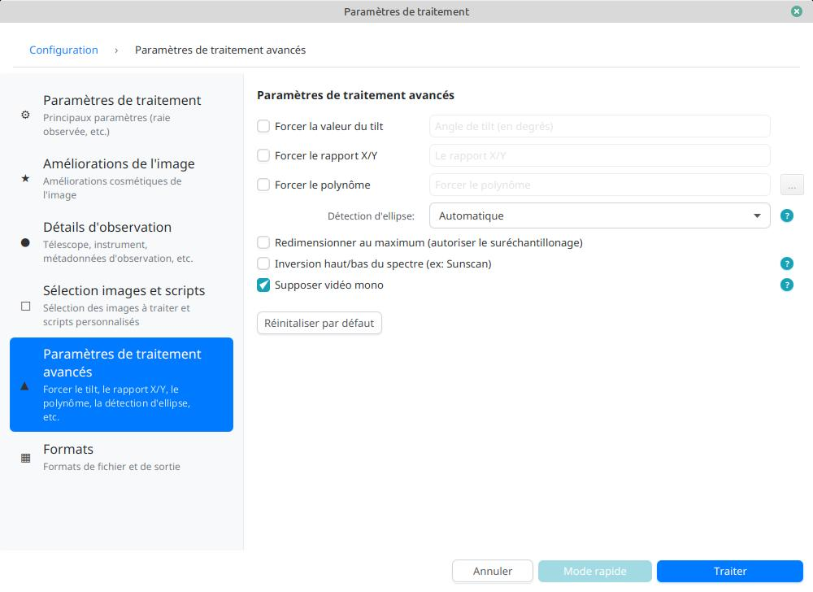
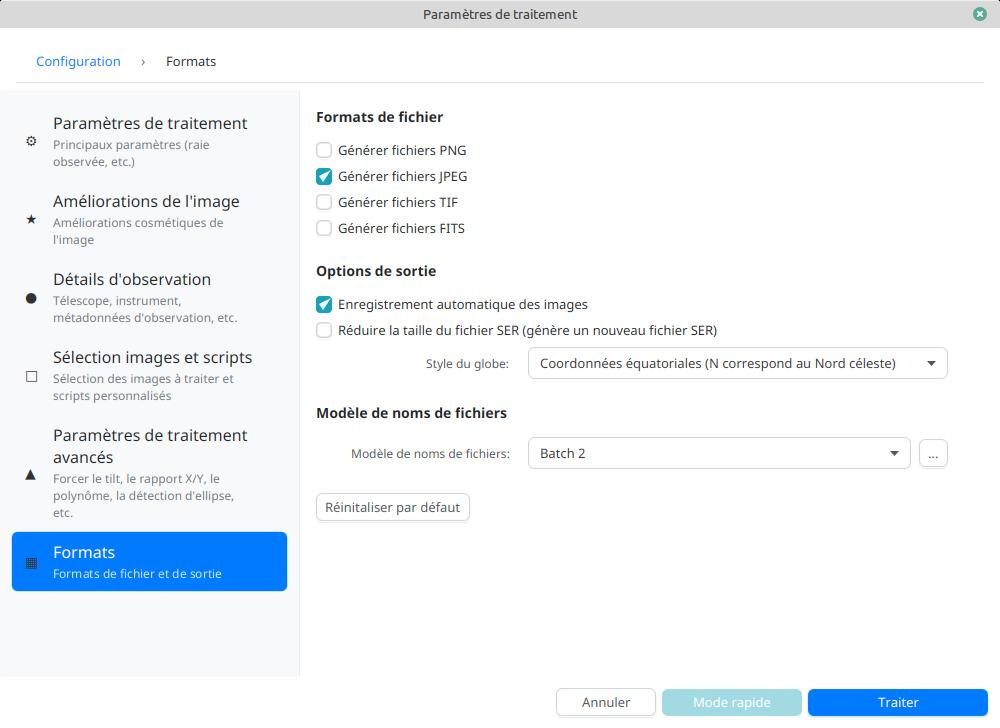

= JSol'Ex
Cédric Champeau
:icons: font
:docinfo: shared

JSol'Ex est un traitement d'images solaires produites par l'intermédiaire du http://www.astrosurf.com/solex/[Sol'Ex de Christian Buil].
Il permet de traiter les fichiers SER capturés avec cet instrument pour produire des images du disque solaire, de manière similaire à http://valerie.desnoux.free.fr/inti/[INTI de Valérie Desnoux].
S'il est principalement conçu pour traiter les images produites par Sol'Ex, il est possible qu'il donne de bons résultats sur d'autres héliospectrographes.

JSol'Ex est un logiciel libre sous licence Apache 2, écrit en Java et fourni à titre gratuit sans aucune garantie.

.Note aux utilisateurs français
[IMPORTANT]
====
**Si vous votez Rassemblement National ou tout autre parti proche de l'extrême droite, je vous demande de ne pas utiliser ce logiciel**

Mes convictions sont diamètralement opposées à celles de ces partis et je ne souhaite pas que mon travail, développé sur mon temps libre avec une licence libre serve à des personnes qui soutiennent ces idées nauséabondes.

La solidarité, le partage, l'ouverture aux autres, la lutte contre les discriminations et les inégalités, le respect de toutes les religions, de tous les genres sont les valeurs qui m'animent. Elles sont à l'opposé de celles prônées par ces partis.

Je vous invite à ne pas céder aux sirènes de la haine et à vous tourner vers des valeurs plus positives, où votre bien-être ne passe pas par le rejet de l'autre.
====

== Téléchargement

Cliquez sur le bouton correspondant à votre système ci-dessous pour télécharger l'installeur de JSol'Ex :

link:https://jsolex.s3.eu-west-3.amazonaws.com/jsolex-windows-latest/{prefixName}-{version}.msi[icon:windows[] JSol'Ex (Windows), role="badge"]
link:https://jsolex.s3.eu-west-3.amazonaws.com/jsolex-ubuntu-latest/{prefixName}_{version}_amd64.deb[icon:linux[] JSol'Ex (Linux), role="badge"]
link:https://jsolex.s3.eu-west-3.amazonaws.com/jsolex-macos-latest/{prefixName}-{version}.pkg[icon:apple[] JSol'Ex (Mac ARM64), role="badge"]
link:https://jsolex.s3.eu-west-3.amazonaws.com/jsolex-macos-13/{prefixName}-{version}.pkg[icon:apple[] JSol'Ex (Mac Intel), role="badge"]

=== Fichiers zips

Certains utilisateurs préfèreront télécharger un fichier zip contenant les binaires: sans installeur, ils suffit de décompresser le fichier zip dans un répertoire de votre choix et de lancer l'application (dans le dossier `bin`, `jsolex.bat` sous Windows, `jsolex` sous Linux et MacOS).

- link:https://jsolex.s3.eu-west-3.amazonaws.com/jsolex-windows-latest/{fullName}-{fullVersion}.zip[ZIP JSol'Ex (Windows)]
- link:https://jsolex.s3.eu-west-3.amazonaws.com/jsolex-ubuntu-latest/{fullName}-{fullVersion}.zip[ZIP JSol'Ex (Linux)]
- link:https://jsolex.s3.eu-west-3.amazonaws.com/jsolex-macos-latest/{fullName}-{fullVersion}.zip[ZIP JSol'Ex (Mac ARM64)]
- link:https://jsolex.s3.eu-west-3.amazonaws.com/jsolex-macos-13/{fullName}-{fullVersion}.zip[ZIP JSol'Ex (Mac Intel)]

=== Compilation depuis les sources

JSol'Ex peut aussi être téléchargé ou installé depuis les sources sur https://github.com/melix/astro4j/releases[cette page].
Des installateurs sont disponibles pour Linux, Windows et MacOS.

Alternativement, vous pouvez lancer JSol'Ex en téléchargeant les sources puis en exécutant la commande:

[source,bash]
----
./gradlew jsolex:run
----

== Communauté

Vous pouvez nous rejoindre sur notre https://discord.gg/y9NCGaWzve[serveur Discord] pour discuter de JSol'Ex, poser des questions, ou partager vos images.

[link=https://discord.gg/y9NCGaWzve]
image::https://discordapp.com/api/guilds/1305595962663768074/widget.png?style=banner2[]

[[donate]]
== Dons

JSol'Ex est un logiciel gratuit, développé sur mon temps libre.
Si vous appréciez mon travail, je n'accepte pas de dons directs.
Cependant, je vous encourage fortement à soutenir l'https://www.helloasso.com/associations/single-tracking-astronomical-repository-for-open-spectroscopy/formulaires/3[association STAROS], qui a initié les projets Sol'Ex et Sunscan et promeut la spectrographie à travers des projets innovants avec des amateurs, des écoles et des collaborations scientifiques.
Vos dons seront donc ma contribution à ce projet et seront grandement appréciés !

Cliquez sur le lien ci-dessous pour faire un don :

image::https://staros-projects.org/assets/img/backgrounds/STAROS_logo_text.png[link=https://www.helloasso.com/associations/single-tracking-astronomical-repository-for-open-spectroscopy/formulaires/3, height=200]

Bien entendu, vous pouvez également envoyer un message d'encouragement ou d'appréciation, c'est toujours agréable à recevoir !

== Traitement d'une vidéo

JSol'Ex ne peut traiter que les fichiers SER, vous devez donc configurer votre logiciel de capture pour utiliser ce format.
La fenêtre principale se présente sous cette forme:

image::main-window-fr.jpg[]

Dans le menu "Fichier", sélectionnez "Ouvrir un fichier SER".
Une fenêtre de paramétrage s'ouvre, avec plusieurs sections:

=== Paramètres de base

La première section est la plus importante pour vos premiers scans, les autres sections vous serviront à affiner le traitement.

image::params-1-fr.jpg[]

- la longueur d'onde d'observation: s'il n'est pas obligatoire de remplir ce champ, le faire vous permettra de bénéficier de la coloration automatique et de fonctionnalités avancées telles que les calculs de vitesse. En cliquant sur les "..." vous disposez de la possibilité d'ajouter vos propres raies si elles ne sont pas listées. Il s'agit ici de la longueur d'onde de la raie la plus sombre de votre fenêtre de capture. Le mode "Autodetect" tentera de trouver la raie parmi celles listées automatiquement.
- décalage en pixels : par défaut, le logiciel trouve la raie la plus sombre dans l'image et calcule un polynôme de second degré pour modéliser cette raie. L'image est reconstituée en prenant les pixels au centre de la raie (décalage = 0). Il vous est possible d'entrer un décalage en pixels pour aller par exemple vers le continuum, ou trouver une raie plus difficile à identifier (ex. Hélium) à partir de la raie la plus sombre.
- le décalage Doppler est utilisé uniquement lorsque vous observez en raie h-alpha pour générer une image Doppler. Par défaut, le logiciel utilise 2 images décalées de 3 pixels pour reconstituer une image en couleur.
- le décalage continuum est utilisé pour générer une image du continuum, proche de la lumière blanche en H-alpha.
- Inversion des canaux rouge/bleu : lorsqu'une image Doppler est crée, le logiciel assigne un décalage au canal rouge et l'autre au canal bleu. Cependant, suivant votre configuration, il peut en résulter une image où les couleurs sont inversées (régions qui s'approchent en bleu au lieu de rouge). Si c'est le cas, cochez cette case pour inverser les canaux.
- Rotation : permet d'effectuer une rotation à gauche ou à droite (90 degrés) de l'image. Ceci peut par exemple être utile dans le cas d'un scan fait en déclinaison, pour corriger l'orientation. Ce paramètre n'affecte pas les images crées avec ImageMath.
- Rognage : permet d'effectuer un rognage automatique de l'image après correction géométrique. Il existe plusieurs modes:
* Aucun: pas de rognage (par défaut)
* Largeur d'origine : l'image sera redimensionnée dans un carré de la taille de la largeur de la vidéo d'origine. Idéal pour les disques solaires complets.
* Rayon (x...) : l'image sera redimensionnée en fonction du rayon du disque solaire, en appliquant un multiplicateur. Peut-être utile par exemple lorsque le disque est tronqué et que l'on veut avoir une image carrée permettant de "remettre" la portion à sa place.
- Correction angle P : lorsque cette case est cochée, l'angle P du soleil sera calculé automatiquement à partir de la date d'observation (disponible dans le fichier SER). Les images seront automatiquement corrigées de cet angle, pour que le Nord soit bien en haut. Ce paramètre n'affecte pas les images générées avec ImageMath, qui doivent faire leur propre correction.
- Inverser l'axe horizontal/vertical : permet de retourner l'image verticalement et horizontalement pour avoir le Nord et l'Est bien orientés

=== Paramètres de correction cosmétique

Le deuxième panneau de paramètres permet de configurer les options cosmétiques :

image::params-2-fr.jpg[]

- Méthode d'amélioration du contraste : vous pouvez choisir entre Autostretch (JSol'Ex) et CLAHE. Selon votre choix, des paramètres supplémentaires seront disponibles.

Pour la méthode Autostretch, vous pouvez configurer:

- le gamma : un gamma plus élevé donnera une image plus sombre
- la correction du fond : une valeur proche de 0 supprimera fortement le fond de ciel, une valeur proche de 1 le conservera tel quel
- amplification des protubérances : si activée, permet de choisir un facteur d'amplification. Plus le facteur est élevé, plus les protubérances seront visibles, au prix d'une démarcation plus forte avec le limbe

Pour la méthode CLAHE, vous pouvez configurer:

- la taille des tuiles
- le nombre de niveaux de l'histogramme
- le facteur de clipping

Viennent ensuite les paramètres de correction de bandes, qui permettent de corriger les bandes transversales qui peuvent apparaître sur les images par exemple à cause de poussières sur la fente.

- Largeur de correction de bande : c'est la largeur des bandes qui sont utilisées pour l'algorithme de correction de transversallium. L'algorithme calcule la valeur moyenne des pixels dans ces bandes et corrige la luminosité d'une ligne en fonction de cette valeur.
- Nombre de passes de correction de bande : plus vous ferez de passes, plus il sera possible de corriger de gros défauts, au prix d'une image moins contrastée et/ou moins lumineuse

Vous pouvez ensuite choisir des paramètres d'accentuation des détails.

Par défaut, aucune déconvolution n'est appliquée, mais vous pouvez choisir l'agorithme de déconvolution et ses paramètres.

Pour la déconvolution de Richardson-Lucy, vous pouvez choisir la taille du PSF synthétique, le facteur sigma et le nombre d'itérations.

Enfin, vous pouvez choisir d'appliquer un filtre d'amélioration des détails à la fin du traitement. JSol'Ex propose trois options d'accentuation :

- **Aucune** : Aucune accentuation n'est appliquée
- **Aiguiser** : Accentuation traditionnelle utilisant un noyau de convolution. Vous pouvez ajuster la taille du noyau (doit être un nombre impair ≥ 3)
- **Masque flou** : Technique d'amélioration plus sophistiquée qui crée un masque à partir de la différence entre l'original et une version floutée de l'image. Cette méthode produit généralement des résultats d'aspect plus naturel avec une meilleure préservation des contours. Vous pouvez ajuster à la fois la taille du noyau et la force de l'effet.

Il est aussi possible d'appliquer une correction de vignettage.
3 modes de correction sont disponibles:

- Aucune correction : pas de correction appliquée
- Flat artificiel : un modèle d'illumination du disque est calculé automatiquement, en sélectionnant des pixels en excluant des percentiles haut/bas. Cette correction fonctionne bien pour des vignétages raisonnables.
- Flat physique : le logiciel est capable d'utiliser un fichier SER contenant un petit nombre d'images, ou bien un flat préenregistré. Il appliquera alors la correction en fonction.

==== Correction des bords dentelés

Ceci est une fonctionnalité expérimentale disponible depuis JSol'Ex 3.1.0.
Elle permet de corriger les bords dentelés qui peuvent apparaître sur les images.
Ces bords dentelés sont fréquents sur les images capturées avec un spectrohéliographe et proviennent de différentes causes :

- la turbulence atmosphérique
- le vent
- une monture qui n'est pas parfaitement équilibrée ou qui se trouve en résonance

La correction de bords dentelés peut améliorer ces défauts de manière spectaculaire.
Elle ne nécessite qu'un paramètre : une valeur "sigma" qui permet d'adjuster le nombre de points pris en compte dans le modèle de correction.
Une valeur de sigma proche de 0 sera très restrictive et ne corrigera que les petits défauts, tandis qu'une valeur de sigma plus élevée corrigera des défauts plus importants, au risque de déformer des protubérances par exemple.

[NOTE]
====
La correction de bords dentelés peut avoir des effets de bord, tels que la déformation de protubérances. Il ne s'agit pas d'une correction parfaite de la turbulence atmosphérique : en effet, elle ne peut pas corriger les effets perpendiculaires à la direction du scan par exemple. Enfin, elle fonctionnera d'autant mieux sur la turbulence "basse fréquence", c'est-à-dire les mouvements lents de l'atmosphère, et moins bien sur les mouvements rapides.
Dans tous les cas, il est recommandé de commencer sans correction et de vérifier le résultat dans tous les cas.
====

=== Détails d'observation

Les paramètres d'observation sont utilisés lorsque vous enregistrez vos images au format FITS, pour remplir certaines métadonnées.
Elles servent aussi à calculer le graphique de longueur d'ondes.

Voici les champs disponibles dans JSol'Ex:

- Observateur : personne qui a effectué l'observation
- Adresse email : adresse e-mail de l'observateur
- Instrument : pré-rempli avec "Sol'Ex"
- Télescope : votre lunette ou télescope utilisé avec votre Sol'Ex
- Longueur focale et ouverture
- Latitude et longitude du site d'observation
- Caméra
- Date : pré-rempli avec les métadonnées du fichier SER, en zone UTC
- Binning : le binning appliqué à la caméra lors de l'acquisition
- Taille des pixels : la taille des pixels de la caméra, en microns
- Inversement haut/bas du spectre : normalement, le spectre doit avoir l'aile bleue en haut et l'aile rouge en bas. Si c'est l'inverse, vous pouvez cocher cette case. C'est typiquement le cas si vous utilisez un Sunscan.
- Mode altazimutal : cochez cette case si vous n'utilisez pas une monture équatoriale mais une monture altazimutale et que vous constatez que l'orientation du disque est incorrecte.

[IMPORTANT]
.Mode altazimutal et correction de l'orientation des images
====
Il est important de comprendre que JSol'Ex n'est pas capable de déterminer si une image est retournée verticalement ou horizontalement, mais il peut calculer l'angle solaire P à partir de la date d'observation.
Cependant, la grille d'orientation qui est générée ne sera correcte que si vous utilisez une monture équatoriale.
Si vous utilisez une monture altazimutale, l'oritentation sera incorrecte, ainsi que la position des étiquettes des régions actives détectées.
Pour corriger cela, vous devez cocher la case "mode altazimutal" et entrer les coordonnées de votre site d'observation : JSol'Ex calculera alors l'angle parallactique et effectuera la correction automatiquement, donnant une image bien orientée.
====

=== Images à générer

Le panneau suivant permet de choisir les images à générer.

image::params-4-fr.jpg[]

Dans cette section vous pouvez choisir individuellement les images qui vous intéressent, ou bien choisir un mode de traitement prédéfini (rapide ou complet).

Vous pouvez aussi choisir d'ajouter des scripts ImageMath pour générer des images personnalisées (voir la <<#imagemath,section sur ImageMath>>).

- Générer des images de debug : permet de générer des images telles que la reconnaissance de contours, la reconnaissance d'ellipse/tilt, l'image moyenne. Utile pour vérifier si le logiciel ne se comporte pas correctement sur votre vidéo et que vous souhaitez vérifier là où il se trompe

=== Paramètres de traitement avancés

Ces paramètres sont destinés à des cas particuliers, pour corriger des problèmes de détection ou pour des travaux avancés.

- Forcer la valeur du tilt : lors de la correction géométrique d'image, JSol'Ex calcule une ellipse pour modéliser le disque solaire reconstitué. Cette ellipse est utilisée pour calculer des paramètre comme l'angle de tilt. Si le calcul effectué par le logiciel est erroné, vous disposez de la possibilité de surcharger la valeur calculée.
- Forcer le rapport X/Y : de manière similaire, sur certaines images dans des raies difficiles, l'ellipse peut ne pas parfaitement correspondre au disque solaire et ne pas reconstituer un soleil parfaitement circulaire. Vous pouvez surcharger le rapport détecté pour corriger ces problèmes
- Forcer le polynôme: permet de forcer le polynôme de second degré utilisé pour modéliser la raie spectrale. Voir la <<#force-polynomial,section sur le forçage du polynôme>> pour plus d'informations.
- Redimensionner au maximum: peut être utilisé si votre vidéo est sur-échantillonnée et que vous souhaitez conserver la résolution maximum. Ceci arrive par exemple si vous faites des scans à basse vitesse (ex, sidérale).

WARNING: Activer ce paramètre peut produire des images sensiblement plus grandes et entraîner une forte pression mémoire. Il n'est pas recommandé d'activer ce paramètre.

- Supposer vidéo mono : si cette cache est cochée, JSol'Ex n'essaiera pas de faire un dématriçage de la vidéo d'entrée, ce qui permet d'accélérer considérablement les temps de traitement. En règle générale, vos vidéos seront en mono, il est donc utile de conserver cette case cochée.

=== Paramètres de sortie

Dans cette section vous pouvez configurer les formats de fichier à générer ainsi que le modèle de nommage des fichiers.

- Enregistrement automatique des images : si cette case est cochée, toutes les images générées sont automatiquement enregistrées sur disque. Dans le cas contraire, vous devrez dans l'interface qui affiche les images générés appuyer sur le bouton "Enregistrer" pour conserver les images produites
- Générer des fichiers FITS : permet de générer des fichiers FITS, non destructifs, en plus des images PNG

[[force-polynomial]]
==== Forcer le polynôme

JSol'Ex effectue une détection de la raie spectrale en cherchant la ligne la plus sombre dans l'image, puis en ajustant un polynôme de 3ème ordre.
Il arrive parfois que la détection soit incorrecte, auquel cas vous pouvez forcer l'utilisation d'un polynôme.
Pour ce faire, cliquez sur le bouton "forcer le polynôme", qui vous permettra d'entrer les coefficients du polynôme.

Le format du polynôme est une liste de 4 nombres entre accolades, séparés par des virgules, par exemple: `{1.3414109042116584E-10,3.889927699830093E-5,-0.056529799336687114,35.76051527062038}`.

La façon la plus simple d'obtenir les coefficients du polynôme est de cliquer sur les "..." qui ouvrira une fenêtre avec l'image moyenne et la raie spectrale détectée.

Vous pouvez alors appuyer sur "CTRL" puis cliquer sur la ligne pour ajouter des points de mesure : une croix rouge sera ajoutée pour chaque point.
Lorsque vous avez suffisamment de points, cliquez sur le bouton "Calculer le polynôme", qui ajustera un polynôme de 3ème ordre aux points et remplira automatiquement le champ "polynôme" dans les paramètres de traitement.

[[modele-noms-fichier]]
==== Modèles de noms de fichier

Par défaut, JSol'Ex enregistre les images produites dans un sous-dossier correspondant au nom de la vidéo, et dans ce sous-dossier un autre sous-dossier par type d'image (raw, debug, traitées, etc...).
Si ce modèle ne vous convient pas, vous pouvez créer vos propres modèles de nommage, en cliquant sur les "...":

Un modèle de nommage consiste en un label (un nom), mais surtout un modèle dont les composantes sont des jetons entre `%`.

Voisi les jetons disponibles:

- `%BASENAME%` est le nom de base du fichier SER, sans l'extension
- `%KIND%` correspond au type d'image générée (raw, debug, ...)
- `%LABEL%` est l'identifiant des images, par exemple `recon`, `protus`, etc...
- `%CURRENT_DATETIME%` est la date et l'heure de traitement
- `%CURRENT_DATE%` est la date de traitement
- `%VIDEO_DATETIME%` est la date et heure de la vidéo
- `%VIDEO_DATE%` est la date de la vidéo
- `%SEQUENCE_NUMBER%` est le numéro de séquence dans le cas d'un traitement en mode batch (avec 4 chiffres, par ex. `0012`)

Par exemple, pour créer un modèle pour mettre toutes vos images dans un même dossier peut être :

`%BASENAME%/%SEQUENCE_NUMBER%_%LABEL%`

Le champ "exemple" donne une idée de ce qui sera généré.

=== Préréglages personnalisés

En complément des préréglages intégrés "Mode rapide" et "Traitement complet", JSol'Ex vous permet de créer et gérer vos propres préréglages personnalisés pour la sélection d'images et la configuration des scripts.

==== Créer un préréglage

Une fois que vous avez configuré vos sélections d'images et scripts souhaités dans la section "Images personnalisées et scripts", vous pouvez sauvegarder votre configuration comme un préréglage :

1. Sélectionnez les images que vous voulez inclure dans votre préréglage
2. Configurez les scripts ImageMath si nécessaire
3. Dans la section "Images personnalisées et scripts", cliquez sur le bouton "Enregistrer votre sélection"
4. Entrez un nom descriptif pour votre préréglage
5. Cliquez sur "OK" pour sauvegarder

Votre préréglage est maintenant sauvegardé et persistera entre les sessions JSol'Ex.

==== Utiliser vos préréglages

Les préréglages personnalisés apparaissent comme des boutons dans la fenêtre de paramètres de traitement, à côté des boutons Mode rapide et Traitement complet. Cliquez simplement sur n'importe quel bouton de préréglage pour appliquer instantanément cette configuration.

Chaque préréglage restaure :
- Toutes les sélections de types d'images (images de base, avancées et personnalisées)
- Les configurations de scripts ImageMath
- Le paramètre de scripts automatiques

==== Gérer les préréglages

- **Charger un préréglage** : Cliquez sur le bouton du préréglage pour appliquer sa configuration
- **Supprimer un préréglage** : Cliquez sur le bouton "×" à côté de n'importe quel préréglage utilisateur pour le supprimer (avec confirmation)
- **Remplacer un préréglage** : Sauvegardez un nouveau préréglage avec le même nom qu'un existant pour le remplacer

Les préréglages utilisateur sont stockés localement sur votre ordinateur et sont automatiquement disponibles à chaque ouverture de JSol'Ex.

== Lancer un traitement

Lorsque vous avez configuré les paramètres, cliquez sur "Traiter" pour lancer le traitement.

Vous avez la possibilité de lancer un traitement rapide ou complet directement en cliquant sur les boutons correspondants en bas à droite.

=== Affichage des images produites

Lorsque les images sont produites, elles apparaissent au fur et à mesure en onglets.
Il vous est alors possible, en fonction des images, de modifier des paramètres de contraste et d'enregistrer les images.

image::image-display-fr.jpg[]

Vous pouvez zoomer dans les images en utilisant la molette de la souris.
Un clic droit vous permettra d'ouvrir l'image générée dans votre explorateur de fichiers ou dans une nouvelle fenêtre.

== Mode surveillance de répertoire

Lors de la mise au point, il peut être utile de traiter "à la chaîne" de nouvelles vidéos jusqu'à avoir obtenu un résultat satisfaisant (image centrée, mise au point correcte, etc.).
JSol'Ex offre une façon simple de gagner du temps, en surveillant un dossier : les vidéos qui apparaissent dans le dossier seront automatiquement traitées.

Pour ce faire, dans le menu fichier, sélectionnez "Surveiller un dossier" puis sélectionnez le dossier dans lequel seront enregistrés vos fichiers SER (par exemple là où SharpCap va enregistrer).

JSol'Ex bascule en mode "surveillance" que vous pouvez interrompre en cliquant sur le bouton en bas à gauche.

Ouvrez maintenant votre logiciel de capture et enregistrez une nouvelle vidéo.
Lorsque vous rebasculerez sur JSol'Ex, le logiciel ouvrira automatiquement la fenètre de paramétrage.
Choisissez vos options et lancez le traitement.

Une fois le résultat obtenu, rebasculez sur le logiciel d'acquisition et enregistrez une nouvelle vidéo.
Lorsque vous rebasculerez sur JSol'Ex, cette fois-ci le logiciel réutilisera les paramètres utilisés lors du traitement de la première vidéo : vous obtiendrez donc rapidement une nouvelle image !

WARNING: Lorsque vous basculez de votre logiciel de capture à JSol'Ex, faites attention à ce que l'enregistrement soit terminé. Dans le cas contraire, le traitement serait lancé sur un fichier SER incomplet, ce qui échouera.

Lorsque vous avez terminé, cliquez sur le bouton "Interrompre la surveillance" en bas à gauche.

TIP: Vous pouvez combiner le fait d'être en mode surveillance avec le fait d'ouvrir une image dans une fenêtre externe (en faisant un clic droit sur l'image choisie). En effet, lors du traitement de la nouvelle vidéo, l'image dans la fenêtre sera automatiquement remplacée par la nouvelle version. Ceci peut par exemple être intéressant dans des présentations publiques, en ayant une fenêtre montrant simplement le résultat du traitement.

[[custom_images]]
== Personnalisation des images générées

Lorsque vous cliquez sur "Personnalisé" au lieu des modes "rapide" ou "complet", JSol'Ex vous permet de choisir bien plus précisément quelles images généres.

Il existe 2 modes : le mode _simple_ et le mode _ImageMath_.

Dans le mode simple, vous pouvez choisir la liste des images générées en cochant chacune d'entre elles, et vous pouvez aussi demander la génération d'images avec des décalages de pixels différents.

Par exemple, si vous souhaitez disposer d'images allant du continuum en passant par la raie explorée, vous pouvez entrer `-10;-9;-8;-7;-6;-5;-4;-3;-2;-1;0;1;2;3;4;5;6;7;8;9;10` ce qui aura pour effet de générer 21 images distinctes, pour des décalages de pixels entre -10 et 10.

Ceci peut être intéressant par exemple si vous les recombinez pour en faire un GIF animé ou une vidéo.

A noter que si vous cochez certaines images comme "Doppler", certains décalages sont automatiquement ajoutés à la liste (ex. -3 et 3).

Si ceci ne suffit pas, vous pouvez utiliser le mode avancé "ImageMath" qui est extrêmement puissant tout en restant simple d'accès.

[[imagemath]]
== ImageMath : scripts de calcul d'images
=== Introduction à ImageMath

Le mode ImageMath permet de générer des images en effectuant des calculs plus ou moins complexes sur des images générées.
Il repose sur un langage de script _simple_ mais suffisamment riche pour faire des traitement complexes.

Reprenons l'exemple précédent, dans lequel il s'agissait de générer l'ensemble des images pour des décalages allant de -10 à 10 pixels.
Dans le mode "simple", il nous a fallu entrer l'ensemble des valeurs à la main, séparés par des points-virgule.
Dans le mode "ImageMath", nous disposons d'un langage permettant de le faire.

Commençez par sélectionner le mode `ImageMath` dans la liste et cliquez sur "Ouvrir ImageMath".
L'interface suivante s'ouvre:

image::imagemath-1-fr.jpg[]

Dans la partie gauche, "Scripts à exécuter", nous trouvons la liste des scripts qui seront appliqués lors du traitement.
Les scripts sont des fichiers enregistrés sur votre disque, que vous pouvez partager avec d'autres utilisateurs.
Leur contenu est éditable dans la partie droite de l'interface.

Effacez le contenu du script d'exemple et remplacez le par:

[source]
----
range(-10;10)
----

Puis cliquez sur "sauvegarder".
Choisissez un fichier de destination et enregistrez.
Le script apparaît désormais dans la liste de gauche, il sera appliqué lors du traitement.

Cliquez alors sur "Ok" pour fermer "ImageMath" et ne conservez que "Après correction géométrique et étendue" dans la liste des images.

Cliquez sur "Ok" pour lancer le traitement, vous obtenez alors les images demandées:

image::imagemath-2-fr.jpg[]

=== Les fonctions d'ImageMath

Nous avons utilisé ici une seule fonction, `range`, qui a permis de générer en une seule instruction une vingtaine d'images, mais il existe de nombreuses fonctions.

Veuillez vous référer à link:imagemath.html[cette page] pour une liste complète des fonctions disponibles.

[[custom-functions]]
=== Fonctions personnalisées

En plus des fonctions fournies par JSol'Ex, il est possible de définir vos propres fonctions, qui combinent des fonctions existantes.
Par exemple, disons que vous souhaitiez dessiner le globe, les détails techniques et les paramètres solaires sur plus d'une image.
Votre script pourrait ressembler à ceci :

[source]
----
image1=draw_obs_details(draw_solar_params(draw_globe(img(0))))
image2=draw_obs_details(draw_solar_params(draw_globe(auto_contrast(img(0);1.5))))
----

Au lieu de répéter les mêmes appels de fonction sur plusieurs images, nous pouvons déclarer une fonction :

[source]
----
[fun:decorate img]                                              <1>
   result=draw_obs_details(draw_solar_params(draw_globe(img)))  <2>

[outputs]
image1=decorate(img(0))                                         <3>
image2=decorate(auto_contrast(img(0);1.5))                      <4>
----
<1> La déclaration de la fonction. Le nom de la fonction est `decorate`, et elle prend un seul argument, `img`.
<2> La fonction doit se terminer par une affectation à la variable `result`.
<3> La fonction est ensuite appelée avec l'image `img(0)`.
<4> La fonction peut également être appelée avec l'image `auto_contrast(img(0);1.5)`.

Les fonctions **doivent** être déclarées au début du script.
Elles peuvent prendre n'importe quel nombre d'arguments, mais elles doivent toujours retourner une valeur dans la variable `result`.
Si vous déclarez une fonction, vous **devez** avoir une section qui sépare les déclarations de fonctions de votre script principal (pour la section `[outputs]`).

Une fonction peut avoir des expressions intermédiaires et peut appeler d'autres fonctions.
Par exemple, créons une fonction qui affichera notre image avec un titre :

[source]
----
[fun:titled img title]                                          <1>
   decorated=decorate(img)                                      <2>
   result=draw_text(decorated, 10, 10, title)

[fun:decorate img]
   result=draw_obs_details(draw_solar_params(draw_globe(img)))

[outputs]
image1=titled(img(0))                                         <3>
image2=titled(auto_contrast(img(0);1.5))                      <4>
----
<1> La déclaration de la fonction `titled`. Elle prend 2 arguments : `img` et `title`.
<2> La fonction `titled` appelle la fonction `decorate`, puis ajoute un titre à l'image.
<3> La fonction `titled` est ensuite appelée avec l'image `img(0)`.
<4> La fonction `titled` peut également être appelée avec l'image `auto_contrast(img(0);1.5)`.

[NOTE]
.Passer une liste à une fonction
====
Le premier argument d'une fonction est toujours traité différemment.
Si une liste est utilisée, alors la fonction sera appelée pour chaque élément de la liste, puis les résultats seront collectés dans une liste.
Par exemple, si nous appelons la fonction `decorate` ci-dessus avec une liste d'images, alors le résultat sera une liste d'images décorées.
Si la fonction prend plus d'un argument, seul le premier argument se comporte de cette manière.
====

[[includes]]
=== Inclure d'autres scripts

Il est possible d'inclure d'autres scripts dans votre script.
Cela peut être utile si vous avez un ensemble de fonctions que vous souhaitez réutiliser dans plusieurs scripts.
Par exemple, nous pourrions extraire les définitions de fonctions de l'exemple précédent et les mettre dans un fichier séparé, `functions.math` :

[source]
.functions.math
----
[fun:decorate img]
   result=draw_obs_details(draw_solar_params(draw_globe(img)))
[fun:titled img title]
   decorated=decorate(img)
   result=draw_text(decorated, 10, 10, title)
----

Ensuite, il peut être inclus dans un autre script :

[source]
.myscript.math
----
[include "functions"]

[outputs]
image1=titled(img(0), "Ma première image")
image2=titled(auto_contrast(img(0);1.5), "Ma deuxième image")
----

[CAUTION]
====
Les inclusions sont résolues par rapport au script qui les inclut.
====

[[remote-scriptgen]]
=== Génération de script à distance

[WARNING]
====
Cette fonctionnalité est expérimentale et peut évoluer à l'avenir.
Elle est conçue pour les utilisateurs avancés qui sont à l'aise avec la programmation.
====

ImageMath est un langage d'expression.
Il ne prend pas en charge les structures de contrôle comme les boucles ou les conditions, ce qui peut parfois être limitant.
De plus, il se peut que vous souhaitiez effectuer des opérations qui ne sont pas disponibles dans le langage lui-même.

Pour prendre en charge ces cas d'utilisation avancés, une fonction spéciale nommée `remote_scriptgen` est disponible.
Cette fonction appellera un service qui sera responsable de générer un script qui contribuera à de nouvelles variables dans le contexte actuel.

La fonction accepte un seul argument, qui est une URL vers le service.
JSol'Ex créera alors une requête `POST` à cette URL, avec une charge utile JSON contenant le contexte actuel, c'est-à-dire la liste des variables avec leurs valeurs au moment de l'appel, mais aussi le contexte comme les paramètres de traitement ou la longueur d'onde détectée.

Le payload JSON a 2 entrées principales : `variables` et `params`.

[source,json]
----
{
  "variables": {
     ... une clé par variable ...
  },
  "context": {
    ... les paramètres du processus ...
  }
}
----

Les variables peuvent être des valeurs simples, comme des nombres ou des chaînes de caractères, mais aussi des tableaux ou des objets comme des images :

[source,json]
----
{
  "variables": {
    "detectedWavelen": 6562.8099999999995,
    "detectedDispersion": 0.10878780004221283,
    "l0": "4.4165",
    "src": {
      "type": "image",
      "width": 1424,
      "height": 1424,
      "file": "/tmp/jsolex/1960308/image9339121918435728514.fits",
      "metadata": {
        "sourceInfo": {
          "serFileName": "12_08_34.ser",
          "parentDirName": "christian",
          "dateTime": "2021-09-05T10:08:34.806652200Z[UTC]"
        },
        "pixelShiftRange": {
          "minPixelShift": -20.0,
          "maxPixelShift": 40.0,
          "step": 6.0
        },
        "solarParameters": {
          "carringtonRotation": 2248,
          "b0": 0.12636308214692193,
          "l0": 4.416504789595021,
          "p": 0.38650968395297775,
          "apparentSize": 0.0091870061684479
        },
        "pixelShift": {
          "pixelShift": 0.0
        },
        "transformationHistory": {
          "transforms": [
            "Rotation à gauche",
            "Retournement",
            "Réduction de bandes (taille de bande : 24 passes : 16)",
            "Correction de géométrie",
            "Recadrage automatique",
            "ImageMath: img(0)",
            "ImageMath: img(0)",
            "ImageMath: img(0)",
            "ImageMath: src=img(0)",
            "ImageMath: range(-1;1;.5)",
            "ImageMath: range(-1;1;.5)",
            "ImageMath: range(-1;1;.5)",
            "ImageMath: range(-1;1;.5)",
            "ImageMath: img(0)",
            "ImageMath: img(0)",
            "ImageMath: img(0)",
            "ImageMath: src=img(0)"
          ]
        },
        "ellipse": {
          "a": 0.7071067811865355,
          "b": -1.1224941413357953E-13,
          "c": 0.7071067811865596,
          "d": -1006.9200564095466,
          "e": -1006.9200564095809,
          "f": 423490.4527558379
        },
        "generatedImageMetadata": {
          "kind": "IMAGE_MATH",
          "title": "src",
          "name": "batch/2025-03-26T225606/src/0000_12_08_34_src"
        }
      }
    },
    "blackPoint": "283.533",
    "angleP": "0.3865",
    "some_var": 123.0,
    "b0": "0.1264",
    "carrot": "2248"
  }
}
----

Dans le cas d'une image, l'objet aura une clé `type` avec la valeur `image`.
Le fichier sera disponible uniquement au format FITS.

[IMPORTANT]
====
Le chemin du fichier est le chemin vers le fichier FITS, qui est un fichier temporaire, **sur l'hôte qui exécute JSol'Ex**.
Par conséquent, vous ne pourrez accéder à ce fichier que depuis le même hôte !
Cela peut également être utilisé pour générer de nouvelles images, qui peuvent être chargées dans JSol'Ex si le script retourné contient une opération `LOAD`.
====

Le service doit retourner un objet JSON contenant une clé `script`, avec le script à exécuter dans JSol'Ex.
Il _peut_ aussi renvoyer un objet avec une clé `error`, qui sera affichée à l'utilisateur.

Les scripts retournés par le serveur sont interprétés dans un contexte séparé, mais ils partagent les variables et fonctions utilisateur du script appelant.
Seule la section **outputs** contribuera à de nouvelles variables dans le contexte.

Par exemple, si un serveur retourne le script suivant :

[source]
----
[tmp]
base=auto_contrast(img(0);1.5)

[outputs]
final=draw_obs_details(draw_solar_params(draw_globe(base)))
----

Alors seule la variable `final` sera visible dans le script appelant après exécution.

[NOTE]
====
Lorsqu'un script appelle la fonction `remote_scriptgen`, JSol'Ex contactera le serveur plusieurs fois avec des charges utiles différentes.
====

=== Scripts ImageMath

Dans la section précédente, nous avons vu les "briques élémentaires" d'ImageMath, qui permettent de calculer des images.
Les scripts permettent d'efficacement combiner ces briques pour en faire de véritables outils puissants pour traiter vos images.

A titre d'exemple, voici un script qui permet de traiter une image dans la raie Hélium.

[source]
----
[params]
# The shifting between the helium line and the detected line (in pixels)
Line=5875.62
HeliumShift=find_shift(Line)
# Banding correction width and number of iterations
BandWidth=25
BandIterations=20
# Contrast adjustment
Gamma=1.5
# Autocrop factor (of diameter)
AutoCropFactor=1.1

## Temporary variables
[tmp]
helium_raw = img(HeliumShift) - continuum()
helium_fixed = fix_banding(helium_raw;BandWidth;BandIterations)
cropped = autocrop2(auto_contrast(helium_fixed;Gamma);AutoCropFactor)

## Let's produce the images now!
[outputs]
helium_mono = cropped
helium_color = colorize(helium_mono, Line)
----

Notre script est décomposé en 3 sections: `[params]`, `[tmp]` et `[outputs]`.
La seule section obligatoire est `[outputs]`: elle permet de définir quelles images nous souhaitons obtenir en sortie.
Le nom des autres sections est arbitraire, vous pouvez en définir autant que vous le souhaitez.

Ici, nous avons une section `[params]` qui permet de mettre en évidence les _paramètres de notre script_, autrement dit ce que l'utilisateur peut configurer.
On y trouve des variables, déclarées par un nom (ex `Line`) et une valeur `5875.62`.
La deuxième variable, `HeliumShift`, est calculée à partir de la fonction `find_shift`, qui prend en paramètre la variable `Line` (et permet de déterminer le décalage en pixels de la ligne par rapport à celle détectée).

NOTE: Une variable doit ne peut contenir que des caractères ascii, des numéros (hors premier caractère) ou le caractère _. Par exemple, `maVariable`, `MaVariable0` et `maVariable_0` sont tous valides, mais `hélium` ne l'est pas.

Ces variables peuvent être réutilisés dans d'autres variables ou des appels de fonctions.

IMPORTANT: Les variables sont sensibles à la casse. `maVariable` et `MaVariable` sont 2 variables distinctes !

Ainsi, notre 2ème section, `[tmp]`, définit des images qui nous servent d'intermédiaire de calculs, mais pour lesquelles nous ne sommes pas intéressés par le résultat.
Ici, nous calculons 3 images temporaires :

- `helium_raw` est l'image de la raie Hélium, décalée par rapport à la raie détectée et à laquelle on a soustrait l'image continuum.
- `helium_fixed` est l'image `helium_raw` à laquelle on a appliqué l'algorithme de correction de transversalliums.
- `cropped` est l'image `helium_fixed` à laquelle on a appliqué un rognage automatique et un ajustement de contraste.

Au final, la section `[outputs]` déclare les images qui nous intéressent :

- `helium_mono` est l'image `cropped` telle quelle, en noir et blanc.
- `helium_color = colorize(fix_banding(helium_raw;BandWidth;BandIterations), "Helium (D3)")` permet d'obtenir une version colorisée.

NOTE: Vous pouvez mettre des commentaires sur une ligne commençant par `#` ou `//`

[[script-parameters]]
=== Paramètres de scripts

Les scripts peuvent optionnellement déclarer des paramètres configurables en utilisant le bloc `meta`.
Bien que ce ne soit pas obligatoire, ajouter des paramètres est fortement recommandé si vous prévoyez de partager votre script avec d'autres, car les utilisateurs peu familiers avec les scripts préfèreront ajuster des paramètres plutôt que de modifier directement le code.

Lorsqu'un script déclare des paramètres, JSol'Ex crée automatiquement des contrôles d'interface utilisateur qui permettent aux utilisateurs d'ajuster les valeurs sans éditer le script.

==== Déclaration des paramètres

Les paramètres sont déclarés dans un bloc `meta` au début de votre script :

[source]
----
meta {
    title = "Script d'empilement amélioré"
    requires = "4.1.0"

    params {
        tileSize{
            type = "number"
            default = 64
            min = 16
            max = 512
            name {
                en = "Tile Size"
                fr = "Taille de tuile"
            }
            description {
                en = "Size of tiles for processing"
                fr = "Taille des tuiles pour le traitement"
            }
        }

        pixelShift {
            type = "number"
            default = 0
            min = -10
            max = 10
            name = "Décalage pixel"
            description = "Décalage en pixels par rapport à la longueur d'onde de référence"
        }

        cropRatio {
            type = "choice"
            choices = "1.0,1.1,1.2,1.5,2.0"
            default = "1.1"
            name = "Ratio de rognage"
            description = "Facteur de multiplication du rayon solaire pour le rognage"
        }
    }
}

[outputs]
result = autocrop(img(pixelShift), cropRatio)
----

==== Types de paramètres

JSol'Ex supporte trois types de paramètres :

* **number** : Valeurs numériques avec contraintes min/max optionnelles
* **string** : Valeurs textuelles
* **choice** : Sélection parmi des options prédéfinies

==== Propriétés du bloc Meta

* **title** : Nom d'affichage pour le script (supporte plusieurs langues)
* **requires** : Version minimale de JSol'Ex requise (affiche un avertissement si non satisfaite)
* **params** : Conteneur pour les définitions de paramètres

==== Localisation

Les noms et descriptions des paramètres peuvent être localisés en utilisant des objets de langue ou des chaînes simples :

[source]
----
name {
    en = "English Name"
    fr = "Nom français"
}
// Ou simplement :
name = "Nom par défaut"
----

Si aucune localisation n'est fournie pour la langue de l'utilisateur, JSol'Ex utilise l'anglais par défaut, puis la première langue disponible.

==== Compatibilité de version

Le champ `requires` assure que les utilisateurs sont avertis si leur version de JSol'Ex peut ne pas supporter toutes les fonctionnalités du script :

[source]
----
meta {
    requires = "4.1.0"  // Avertit les utilisateurs avec des versions plus anciennes
}
----

[[trimming-ser-files]]
== Réduire la taille des fichiers SER

Il n'est pas rare d'avoir des fichiers SER qui contiennent beaucoup de trames vides au début ou à la fin, en raison de la façon dont nous capturons généralement les vidéos : nous commençons la capture, puis nous attendons que le montage se stabilise, enfin nous arrêtons la capture.
De plus, notre fenêtre de rognage peut être un peu trop grande pour ce que nous voulons réellement étudier.

En conséquence, les fichiers SER stockés sur le disque sont généralement beaucoup plus grands que ce qu'ils devraient être.
Depuis JSol'Ex 2.10, une nouvelle option est disponible à la fin du traitement d'un fichier.
Vous pouvez cliquer sur le bouton "Réduire SER" en haut à droite de l'interface, ce qui ouvrira une nouvelle fenêtre :

image::trimming-fr.jpg[]

Cette fenêtre est pré-remplie avec des paramètres déduits du fichier traité.
En particulier, les trames de début et de fin, ainsi que les valeurs X mininum et maximum (largeur) sont déterminées automatiquement à partir de la détection du disque solaire dans la vidéo.
Une marge raisonnables de 10% est ajoutée, ce qui signifie que parfois, la première et la dernière trame peuvent en fait correspondre à la vidéo complète si vous avez réellement une vidéo où le soleil apparaît rapidement dans le champ de vision.

Les paramètres "pixels vers le haut"/"pixels vers le bas" correspondent au nombre de pixels que vous souhaitez conserver dans le fichier SER cible autour de la ligne spectrale.
Une fois de plus ces valeurs sont déduites de ce qu'il est possible de faire en corrigeant le "sourire" (courbature de la ligne spectrale), mais il peut être particulièrement intéressant de les réduire, car cela aura un impact important sur la taille du fichier.
Cependant, réduire le nombre de pixels vers le haut/bas supprimera des informations de la vidéo (vous ne pourrez pas calculer d'images avec des décalages de pixels plus importants), alors soyez toujours prudent de ne pas trop les réduire.

Une fois que vous êtes satisfait des paramètres, cliquez sur "Réduire" et un nouveau fichier SER sera créé dans le même dossier que l'original, avec le suffixe `_trimmed`.

Il est important de savoir que la vidéo rognée aura également la correction du sourire appliquée, ce qui signifie que la ligne spectrale sera centrée dans la vidéo et que chaque ligne sera parfaitement horizontale.
Cette information est utilisée par JSol'Ex si vous décidez de traiter la vidéo rognée, de sorte que vous n'ayez pas à recalculer la correction du sourire.

[IMPORTANT]
====
Il est important de comprendre que la réduction de fichier SER est une opération destructive : si vous réduisez le nombre de trames ou les valeurs min x/max x, alors vous tronquez potentiellement le disque solaire ou des caractéristiques comme les protubérances.
Si vous choisissez des valeurs trop faibles pour les pixels vers le haut/bas, alors vous réduisez la bande passante de l'observation, ce qui signifie par exemple que vous ne pourrez plus générer d'image de continuum.
Dans les deux cas, le résultat du traitement de la vidéo rognée sera différent de l'original.
====

Voici un exemple de résultat :

++++
<video width="100%" controls autoplay loop>
  <source src="orig.webm" type="video/webm">
  Your browser does not support the video tag.
</video>
++++

Et la version réduite :

++++
<video width="100%" controls autoplay loop>
  <source src="trimmed.webm" type="video/webm">
  Your browser does not support the video tag.
</video>
++++

[[batch-mode]]
== Traitement par lots

En plus du traitement individuel, JSol'Ex propose une mécanique de traitement par lot.
Dans ce mode, plusieurs vidéos sont traitées en parallèle, permettant de générer rapidement un grand nombre d'images, qui peuvent par exemple être ensuite envoyées dans un logiciel d'empilement tel qu'AutoStakkert!.

Pour lancer un traitement en lot, il faut aller dans le menu "Fichier" et cliquer sur "Traiter un lot".
Sélectionnez alors l'ensemble des fichiers SER à traiter (ils doivent se trouver dans un seul et même dossier).

La même fenètre de paramétrage que dans le mode fichier seul s'ouvre alors.
Elle permet de configurer le traitement, mais cette fois si pour le lot complet.
Lorsque le traitement est lancé, il y a cependant quelques différences:

1. les fichiers seront systématiquement enregistrés, indépendemment de la case "enregistrement automatique des images"
2. les images ne s'affichent pas dans l'interface, mais une liste des fichiers traités à la place

image::batch-mode-fr.jpg[]

La liste des fichiers comprend le _fichier de log_ du traitement de ce fichier, ainsi que toutes les images générées pour ce fichier.

NOTE: En mode batch, nous recommendons d'utiliser un <<#modele-noms-fichier,modèle de nom de fichier>> qui met toutes les images dans le même dossier, ce qui rendra plus simple leur exploitation dans un programme tiers.

=== Passage en revue des images traitées en lot

Une fois qu'un lot a été traité, il est possible de passer en revue les images générées.
Ceci permettra, par exemple, de ne conserver que les images avec un disque sans passage nuageux, ou les images sans déformations.

Pour ce faire, dans les options de traitement, dans l'onglet "divers", cochez la case "Passer en revue les images après traitement en lot" :

image::image-filtering-3-fr.jpg[]

Lorsque le traitement est terminé, une nouvelle fenêtre s'ouvre, vous permettant de passer en revue les images traitées :

image::image-filtering-1-fr.jpg[]

En haut à droite, vous pouvez choisir entre rejeter une image, la conserver, ou la définir comme la meilleure image.
La meilleure image est alors affichée à gauche, et l'image courante à droite.
Vous pouvez ainsi comparer chaque image à la meilleure image, et décider si vous la conservez ou non.

Dans la liste de gauche, vous disposez de la liste des images générées pour chaque fichier SER.
En bas à droite, vous pouvez passer à l'image suivante ou précédente, et terminer le processus.

Lorsque vous avez fini, la fenêtre suivante s'ouvre :

image::image-filtering-2-fr.jpg[]

Elle vous permet de choisir ce que vous voulez faire des images qui ont été rejetées : les conserver, les supprimer, ou les déplacer dans un sous-dossier (par défaut, elles seront déplacées).
De même, vous pouvez choisir ce que vous voulez faire des fichiers SER qui ont servi à générer ces images rejetées : les conserver, les supprimer, ou les déplacer dans un sous-dossier.

Si vous utilisez un script en mode batch, la partie `[[batch]]` du script ne s'exécutera que pour les images que vous avez conservées, ce qui permettra donc, par exemple, de faire un stacking uniquement sur les images de qualité.

A noter que dans les fonctions `stack` et `stack_ref`, vous disposerez alors de la possiblitité de spécifier la méthode de sélection de la référence `manual`, qui choisira alors la meilleure image que vous avez sélectionnée.

[[script-batch]]
=== Extensions d'ImageMath disponibles en mode batch

Lorsque vous utilisez le mode batch, une nouvelle section est disponible dans les <<#imagemath,scripts ImageMath>>.
Cette section permet de composer des images à partir du résultat du traitement de chaque image individuelle.
Typiquement, ceci peut-être utilisé pour faire de l'empilement.

Cette section doit apparaître en fin de script et se délimite par le bloc `\[[batch]]`:

[source]
----
#
# Empile des images en utilisant le mode batch
#

[params]
# banding correction width and iterations
bandingWidth=25
bandingIterations=3
# autocrop factor
cropFactor=1.1
# contrast adjustment
gamma=1.2

[tmp]
corrected = fix_banding(img(0);bandingWidth;bandingIterations) # <1>
contrast_fixed = auto_contrast(corrected;gamma)                # <2>

[outputs]
cropped = autocrop2(contrast_fixed;cropFactor;32)              # <3>

# This is where we stack images, simply using a median
# and assuming all images will have the same output size
[[batch]]                                                      # <4>
[outputs]
stacked=sharpen(median(cropped))                               # <5>
----
<1> Pour chaque film, on calcule une image intermédiaire corrigée (qui ne sera pas stockée sur disque)
<2> On applique une correction de contraste sur cette image corrigée
<3> Important pour l'empilement : on réduit les images à un carré centré sur le disque solaire et on arondit les dimensions à un multiple de 32 pixels. Il s'agit de notre image de sortie pour chaque film du lot.
<4> On déclare une section `\[[batch]]` pour décrire la sortie du mode batch
<5> Une image nommée `stacked` sera calculée en utilisant la médiane des images `cropped`

Il est important de bien comprendre que seules les images apparaissant dans la partie `[outputs]` du traitement individiduel peuvent être utilisées dans la section `\[[batch]]`.
Ainsi, une image `cropped` apparaissant dans la partie individuelle devient implicitement une _liste_ d'images dans la section `\[[batch]]`: on travaille bien sur la liste des images générées dans le lot !

Certaines fonctions comme `img` ne sont pas disponibles dans le mode `batch`.
Si vous avez besoin d'images individuelles, vous devez les stocker dans une variable de sortie.
Par exemple:

[source]
----
[outputs]
frame=img(0)       # <1>

[[batch]]
[outputs]
video=anim(frame)  # <2>
----
<1> Pour que `img(0)` soit disponible dans la section `batch`, on l'assigne dans une variable nommée `frame`
<2> On crée une animation dont chaque image est constituée d'une `frame`

=== Scripts indépendants

Une dernière façon d'utiliser des scripts est de réutiliser des résultats de sessions précédentes (typiquement des images traitées lors d'une ou plusieurs sessions) sans avoir besoin de traiter une nouvelle vidéo.

Pour se faire, vous pouvez passer par le menu "Outils" puis "Editeur ImageMath".
L'interface qui apparaît est exactement la même que lors du traitement d'une vidéo ou d'un lot de vidéos.
La principale différence dans ce mode est que les images doivent être chargées avec les fonctions `load` ou `load_many` (au lieu d'utiliser `img`).

IMPORTANT: Si vous utilisez ce mode, il est important de charger des images enregistrées au format FITS. En effet, ces images contiennent des métadonnées telles que les ellipses détectées, les paramètres de traitement, etc. qui permettent de faire les mêmes traitements avec des images enregistrées sur disque que ceux obtenus dans une session de traitement classique.

== Mesures

=== Mesures de décalage vers le rouge

Si vous traitez une image H-alpha, JSol'Ex peut automatiquement rechercher dans l'image des régions où le _redshift_ (décalage vers le rouge ou vers le bleu) est particulièrement fort.

Pour se faire, vous devez soit sélectionner le mode "complet" lors du traitement, soit cocher la case "Mesures de décalage vers le rouge" dans la sélection personnalisée des images.

Les mesures ne seront valides **que** si la taille des pixels renseignée est correcte **et** que vous utilisez un Sol'Ex (d'autres spectrohéliographes ont des focales différentes).

Lors du traitement, une image supplémentaire sera générée avec les régions entourées en rouge et la vitesse associée.

De plus, si vous sélectionnez les images de débug, les parties du spectre ayant permis de trouver ces régions seront affichées.

Enfin, une fois la détection effectuée, il vous est possible de générer 2 nouveaux types de rendus, en vous rendant sur l'onglet "Redshift":

image::redshift-tab.jpg[]

La taille correspond à la taille minimale de la région à capturer, en pixels.
Une petite région sera centrée autour du filament détecté, mais pourra être assez pixelisée selon les cas.
La marge permet de choisir combien, en décalage de pixels, prendre de marge par rapport à ce qu'a détecté JSol'Ex.
Par exemple, JSol'Ex peut trouver un décalage maximum de 20 pixels, mais vous pouvez souhaiter ajouter 2 ou 4 pixels de marge pour une animation et bien voir apparaître le filament.

Enfin, sélectionnez le type de rendu :

- Animation : génère une vidéo dont chaque image est décalée de 0.25 pixels
- Panneau : génère une seule image, un panneau où chaque case correspond à un décalage de pixels différent

image::pixel-shift-panel.jpg["Example of panel"]

=== Mesures avec l'analyseur de vidéo

JSol'Ex propose un outil permettant de visualiser la détection des lignes spectrales sur une vidéo.
Cet outil peut être utilisé pour trouver, par exemple, le décalage de pixels à appliquer pour trouver la raie hélium.

Pour se faire, ouvrez une vidéo en cliquant sur "Outils -> Analyseur de vidéo".
Le logiciel va calculer l'image moyenne pour la vidéo puis vous présenter cette fenêtre:

image::spectral-debug-1-fr.jpg[]

En haut, vous voyez l'image moyenne.
La ligne rouge correspond à la ligne spectrale détectée.
Sous la ligne violette s'affiche une image _corrigée en fonction du polynôme_ : ceci vous permet de vérifier facilement si le polynôme est correct: l'image du bas doit avoir des lignes spectrales parfaitement horizontales.

Dans la partie basse de l'interface, vous trouverez:

- le bouton radio "Moyenne / Images" qui permet de basculer entre l'image moyenne et les images individuelles du film SER
- lorsque "Images" est sélectionné, le slider à droite permet de naviguer dans la vidéo
- le seuil de détection du soleil peut être changé (non recommandé, le logiciel ne permet pas de modifier cette valeur, c'est un mode expert)
- la case "vérouiller le polynôme" permet de figer la détection de ligne spectrale sur l'image actuelle : elle nous sera utile pour les mesures de distances
- le slider "contraste" permet d'augmenter le contraste et la luminosité de l'image (transformation arcsin hyperbolique)

=== Application au calcul de décalage de la raie hélium

Nous supposerons ici que notre fichier SER est une vidéo incluant à la fois la raie spectrale Hélium et une autre raie suffisamment sombre pour être bien détectée par JSol'Ex.

Nous pouvons alors procéder par étapes.

- vérouiller le polynôme sur l'image moyenne

image::spectral-debug-2-fr.jpg[]

- sélectionner le mode "Images"

image::spectral-debug-3-fr.jpg[]

- Augmenter le contraste

image::spectral-debug-4-fr.jpg[]

- Choisir une image au bord du limbe

image::spectral-debug-5-fr.jpg[]

Nous pouvons désormais effectuer des mesures.
Lorsque vous déplacez la souris sur l'image, des coordonnées s'affichent :

image::spectral-debug-6-fr.jpg[]

Les 2 premiers nombres sont les coordonnées (x,y) du point sous le curseur de la souris.
Le 3ème nombre est celui qui nous intéresse : c'est le décalage en pixels entre le point sous le curseur et la ligne spectrale en rouge.

Le 4ème nombre nous permet d'obtenir une mesure plus précise, en calculant une moyenne sur un nombre d'échantillons.

Pour ajouter un échantillon, trouvez un point sur la raie hélium et appuyez sur "CTRL" tout en cliquant.
Vous pouvez ajouter autant de points que vous le souhaitez:

image::spectral-debug-7-fr.jpg[]

Le 4ème nombre représente la distance moyenne calculée.
**Nous en déduisons que le décalage de pixels à appliquer est de -134**.

[[stacking-and-mosaic]]
== Empilement et création de mosaiques

JSol'Ex dispose d'un outil permettant d'empiler des images et de créer des mosaïques.
Les 2 outils sont très similaires, mais l'empilement est plus simple à utiliser.
L'empilement consiste à prendre plusieurs images de la même région du soleil et à en faire une seule image, en alignant les détails et en moyennant les pixels.
La mosaïque consiste à prendre plusieurs images de régions différentes du soleil et à les assembler pour former une image plus grande.

Les 2 outils sont disponibles en passant par le menu "Outils" puis "Empilement et création de mosaïques".

La fenêtre qui s'ouvre est la suivante:

image::stacking-1-fr.jpg[]

A gauche, vous pouvez créer des panneaux d'images à empiler.
Si vous ne créez qu'un seul panneau, il s'agira d'un empilement simple.
Si vous créer plusieurs panneaux, il s'agira d'une mosaïque.
Un panneau contiendra une ou plusieurs images, qui seront empilées ensemble.
Pour créer un panneau, vous pouvez, au choix:
- cliquer sur le bouton "+" et sélectionner les images à empiler
- faire un glisser-déposer d'une ou plusieurs images depuis votre explorateur de fichiers

image::stacking-2-fr.jpg[]

Dans l'image ci-dessus, nous avons créé 2 panneaux.
Le premier contient 3 images qui seront empilées pour faire le panneau nord, et le second contient 2 images qui seront empilées pour faire le panneau sud.

Les options d'empilement sont visibles à droite.
Il n'est pas recommandé de les modifier, sauf si vous savez ce que vous faites.
Les options sont les suivantes:

- la taille des tuiles permet de découper l'image en tuiles pour l'empilement. Plus la taille est petite, plus l'empilement sera précis mais le calcul sera plus long et il ne sera pas possible de découvrir des décalages importants entre les images.
- l'échantillonage permet de déterminer où seront pris les échantillons servant à calculer le modèle de distorsion. Un facteur de 0.5 combiné à des tuiles de 32 pixels signifie par exemple un échantillon tous les 16 pixels.
- Forcer le recalcul des ellipses permet de recalculer l'ellipse (ou le cercle) du disque solaire pour chaque image. Ceci est utile notamment si vous utilisez des images venant d'un autre logiciel ou que les ellipses ont été mal détectées.
- Corriger la géométrie permet de rendre le disque solaire parfaitement circulaire, ce qui est généralement une bonne idée si les images que vous importez n'ont pas été corrigées.

Le script de post-traitement vous permet de sélectionner un script `ImageMath` à appliquer à chaque image après empilement.

NOTE: Dans un script de post-traitement, l'image empilée est disponible sous le nom de `image`. Par exemple, vous pouvez créer un script qui appliquera une déconvolution en utilisant la formule `rl_decon(image)`.

Les autres options disponibles sont celles de sélection des formats de fichier.
Si vous avez créé plusieurs panneaux, nous passons alors en mode mosaïque.
Non seulement les images seront empilées dans chaque panneau, mais chaque image empilée sera ensuite assemblée pour former une mosaïque.

WARNING: Il est recommandé de ne PAS utiliser d'images traitées (par exemple avec amélioration de contraste) pour la création de mosaïques. En effet, ces images sont plus difficiles à aligner. Il est donc recommandé d'utiliser les images `recon` (corrigée géométriquement) ou `raw` (brute).

image::stacking-3-fr.jpg[]

Si vous souhaitez simplement empiler des images sans faire de mosaique, vous pouvez désactiver l'option "Créer la mosaïque".
Dans le cas contraire, vous disposez de paramètres qu'il est possible de modifier, encore une fois, si vous savez ce que vous faites.
Nous recommandons de ne pas changer la taille des tuiles et le chevauchement pour la mosaïque, sauf si vous obtenez des images déformées ou non reconstruites.

Vous pouvez aussi choisir un script de post-traitement à appliquer après la création de la mosaïque.

== Calculatrice d'exposition optimale

Dans le menu "Outils", vous trouverez la calculatrice d'exposition optimale.
Cette calculatrice vous permet de déterminer le temps d'exposition optimal que vous devrez utiliser pour obtenir une image du soleil parfaitement ronde et éviter le sous-échantillonage.

Entrez :

- la taille des pixels de votre caméra et le binning utilisé
- la longueur focale de votre instrument
- la vitesse du scan (en multiple de la vitesse sidérale, par exemple 2, 4, 8, ...)
- la date d'observation

Le logiciel calculera alors le framerate recommandé annsi que l'exposition optimale en fonction de ces paramètres, en millisecondes.

Notez que vous pouvez changer le type de spectrohéliographe utilisé, ce qui peut changer le calcul de l'exposition optimale.

== Explorateur de spectre

L'explorateur de spectre est disponible dans le menu "Outils".
Il permet de visualiser l'aspect du spectre tel qu'il serait vu dans un logiciel de capture tel que SharpCap ou FireCapture.
Il vous permet de vous "promener" dans le spectre :

image::spectrum-browser-1.jpg[]

Dans la case "Longueur d'onde", vous pouvez saisir une longueur d'onde en Angströms.
En cliquant sur "Aller" ou en tapant entrée, le spectre sera automatiquement centré autour de cette longueur d'onde :

image::spectrum-browser-2.jpg[]

Une ligne pointillée bleue est ajoutée, vous permettant de bien repérer la ligne.

Alternativement, vous pouvez rechercher directement une ligne spectrale remarquable en la sélectionnant dans la boîte à côté du bouton "Aller".

Lorsque vous cliquez sur "Coloriser", le spectre est alors colorisé de façon à vous donner une idée d'où vous vous situez dans le spectre visible (nous recommandons cependant de rester en niveaux de gris pour repérer précisément une raie) :

image::spectrum-browser-3.jpg[]

Sur la deuxième ligne, vous avez la possibilité de choisir le spectrohéliographe qui a été utilisé (celui-ci aura une influence sur la dispersion spectrale calculée), ainsi que de préciser la taille des pixels (pensez à multiplier par le _binning_).

Si vous cochez la case "Ajuster dispersion", la dimension du spectre est automatiquement ajustée pour correspondre précisément à la dispersion par pixel.

Vous pouvez zoomer soit en cliquant sur les boutons "+" et "-", ou, plus simplement, en appuyant sur "CTRL" et en faisant tourner votre molette de souris.
Si vous zoomez, l'ajustement automatique est désactivé (puisqu'il ne correspond plus à la dispersion exacte par pixel).

=== Identification automatique

Enfin, JSol'Ex propose une fonctionnalité encore expérimentale : vous pouvez cliquer sur le bouton "Identifier" pour ouvrir une fenêtre de sélection de fichier.

Choisissez alors une image du spectre, telle que capturée par votre logiciel.
JSol'Ex essayera alors de retrouver dans quelle partie du spectre elle se trouve :

image::spectrum-browser-4.jpg[]

Si l'identification fonctionne, votre image sera affichée en transparence, par dessus le spectre, sur la partie gauche de l'image, ce qui vous permettra de vérifier facilement si l'identification a réussi.

Vous pouvez masquer l'image en transparence en cliquant sur le bouton "Cacher".

== Serveur Web embarqué

Dans le menu "Outils", vous trouverez la possibilité de lancer un serveur web embarqué.
Ce serveur permet de voir les images traitées par le logiciel depuis d'autres ordinateurs, en se connectant à ce serveur.

Cette fonctionalité peut-être particulièrement pratique lors de projections publiques, en ayant un ordinateur utilisant JSol'Ex pour l'acquisition des images et un autre ordinateur sur le même réseau pour la projection sur un écran.

image::embedded-server-1-fr.jpg[]

Vous pouvez configurer le port sur lequel le serveur écoute et disposez de la possibilité de le lancer automatiquement au démarrage du logiciel.

L'interface donne accès aux images en cours de traitement ainsi qu'à leur historique, au cas où vous traitez plusieurs images successivement.

image::embedded-server-2-fr.jpg[]

== Remerciements

- Christian Buil pour avoir conçu le Sol'Ex et diriger la communauté d'une main de maître
- Valérie Desnoux pour son travail remarquable sur INTI
- Jean-François Pittet pour ses rapports de bugs, ses vidéos de test et ses formules de correction géométrique
- Sylvain Weiller pour son beta-testing intensif, ses retours précieux et ses idées de traitement
- Ken M. Harrison pour l'amélioration des calculs d'exposition optimale
- Minh Trong Nguyen pour ses suggestions d'amélioration et son travail sur le SHG 700

