# JSol'Ex

JSol'Ex is an application to process [Sol'Ex](http://www.astrosurf.com/solex/) video files.
It is similar to [INTI](http://valerie.desnoux.free.fr/inti/) but is fully written in Java instead of Python.

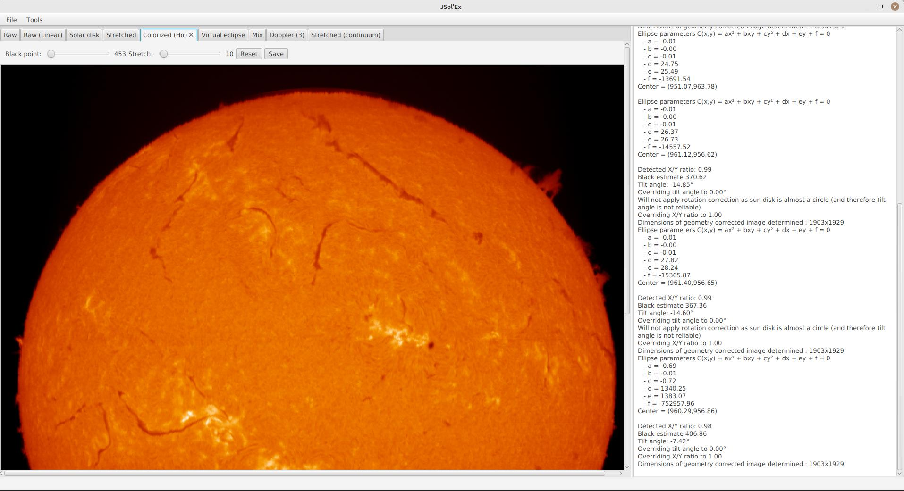

JSol'Ex is available as a desktop application, but also as a command-line tool.

## Downloads

Currently direct downloads are only available for the desktop applications (CLI must be built from sources).

Please refer to the [homepage](../README.md) for download links.

## Features

JSol'Ex is currently experimental.
It was implemented as an exercise and doesn't have all the features of INTI.
Since I didn't have any idea of how INTI is performing its processing, I implemented my own algorithms.

In a nutshell, JSol'Ex will:

- read Sol'Ex video files, extracting frames and performing debayering if needed.
- perform Sun borders detection via contrast detection. This is used to restrict the processing to the Sun disk.
- for each frame within the sun disk, we'll have an image which looks like this:

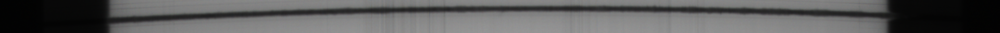

- because of optics, each frame is distorted, so we analyze the frame to find the distortion and correct it: in the image below, the red line shows the distortion, corresponding to the middle of the spectral line to analyze:

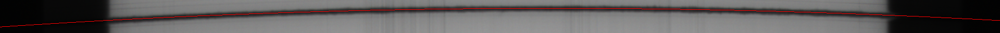

The application can generate images to check if the line was properly detected:

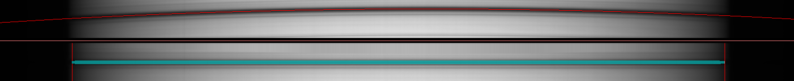

Now we can proceed with reconstruction of the sun disk, by selecting, in each frame, the line in the middle of the spectrum.
Because the dynamic range is pretty low here, we also need to perform brightness correction, which we do in 2 flavors.
The first one is simply a linear correction:

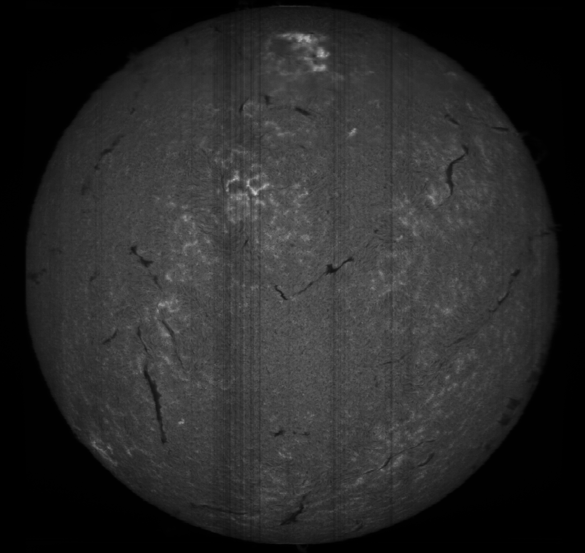

And another one using an asinh function:

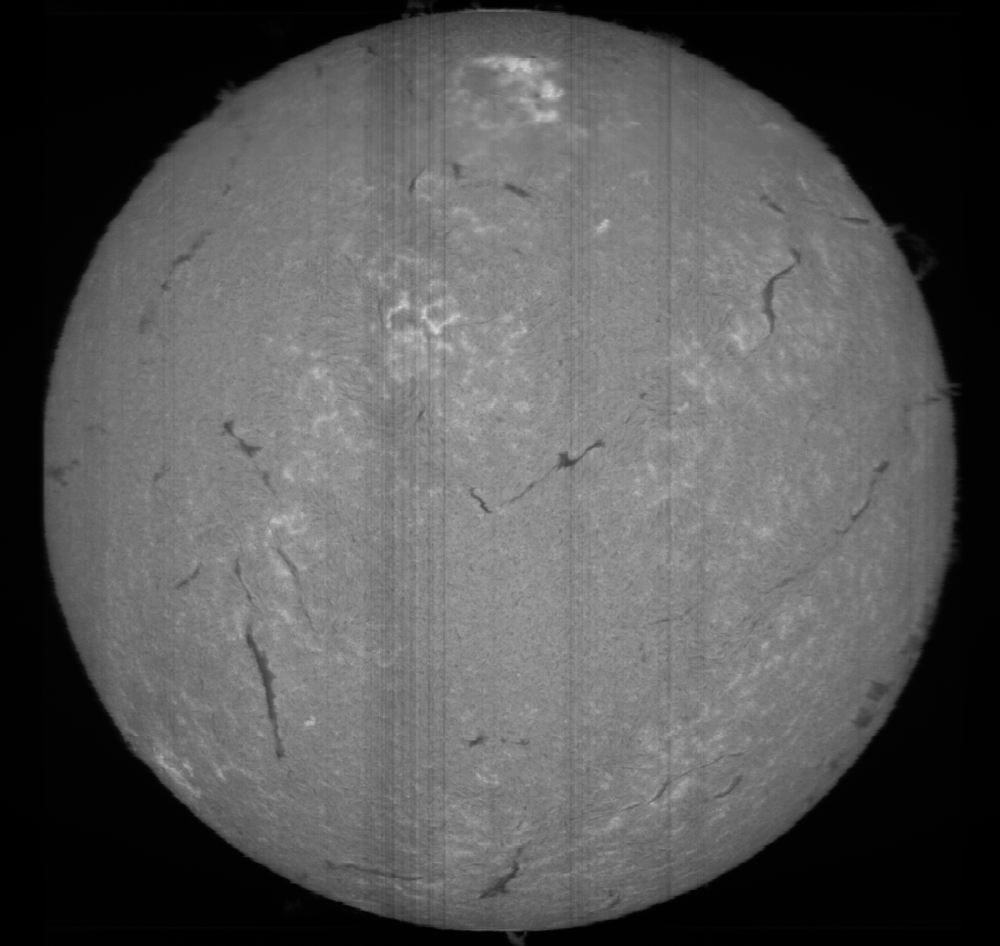

Once we have reconstructed the disk, the next step is to perform a rotation: scanning is done from East to West (or the other way around), and reconstruction is done in that direction, which means that we either have East or West at the top of the image: because we can't know, we perform a left rotation, assuming that East will be on the left.
It's worth noting that you have options to perform vertical or horizontal flips in order to match your camera orientation.

The next step is to perform banding correction.
Banding corresponds to transversalium lines which can be present because of dust on sensors, typically.
The algorithm I have implemented performs correction by computing the average brightness of lines around a particular line.
If the current line brightness is below the average, we perform a correction to bring it closer to the average.
This operation is repeated a number of times.
It is possible to configure the width of the banding correction, which corresponds to the number of lines which are taken into account when computing the average of lines.
Similarly, the number of passes can be tweaked.
It is recommended to reduce the number of correction passes, since too many passes can create artifacts at the sun limb.

The next operation is to compute an ellipse fitting the reconstructed disk, in order to perform geometry correction.

The ellipse parameters are then used to determine the tilt angle and the X/Y correction ratio.
The image is therefore rotated and resampled so that the disk appears perfectly round.
It is worth noting that if, in the initial video, the disk is almost round, then the computed tilt is not numerically stable and therefore not relevant.
In this case we won't perform a rotation (but you have the option to override the detected tilt and x/y ratio in any case).

Once the image is corrected for geometry, we can continue with processing steps.

### Virtual Eclipse

Because we now have performed a geometry correction, we are able to properly identify the center of the disk as well as its diameter.
We can use this information to produce a virtual coronagraph, by masking the sun disk then saturating the limb:

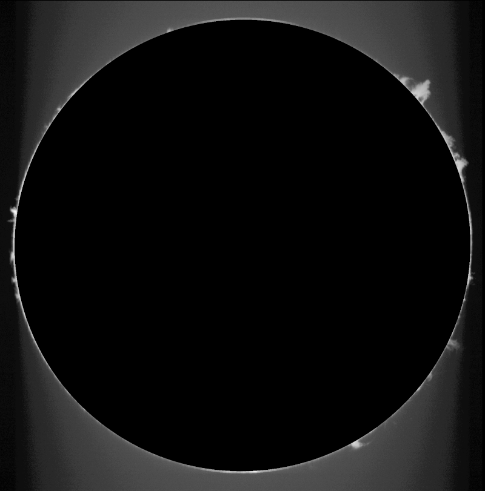

### Colorized image

JSol'Ex assumes mono images.
It is however capable of generating colorized images for some spectral rays.
For this, you have to select the wavelength before processing the image (for example, H-alpha).

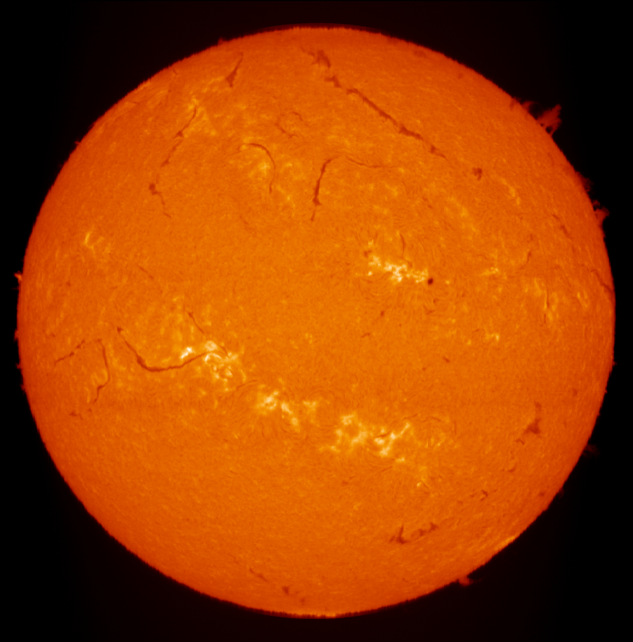

### Combined image

Now that we have a coronagraph and a colorized image, we can combine the 2 to produce a combined image which highlights both the sun disk and the protuberances.

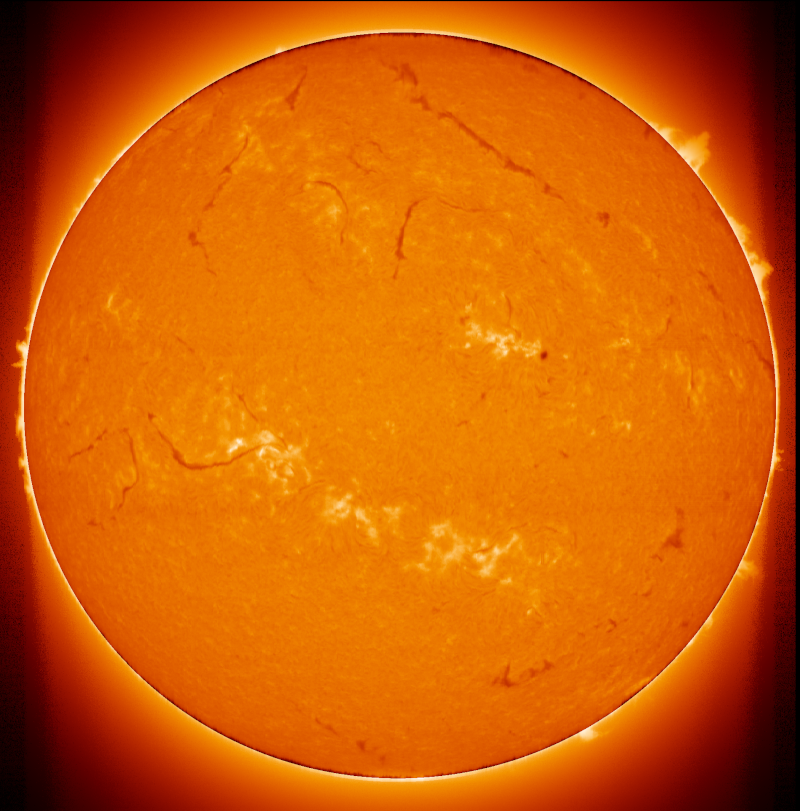

### Doppler images and shifted images

JSol'Ex is capable of reconstructing several images in parallel.
For example, we can reconstruct an image from the center of the spectral line, which gives us all the images above, but we can also generate images "shifted" by a few (3) pixels, which will let us generate a doppler image:

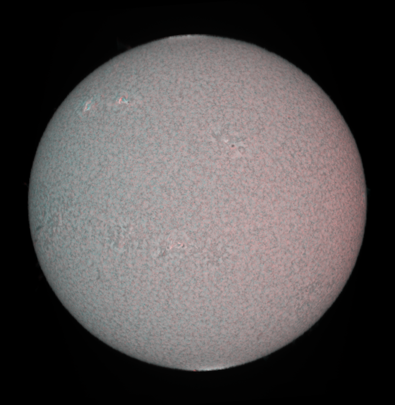

Similarly, by shifting up to 15 pixels, we can generate an image of the continuum:

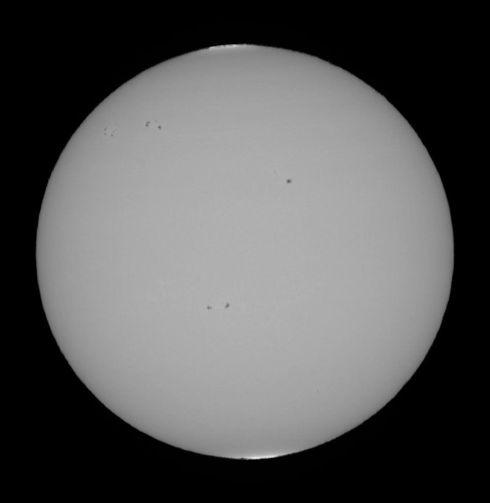

JSol'Ex is licensed under Apache License version 2.
